# Entendendo slots

Existem alguns tipos diferentes de slots:

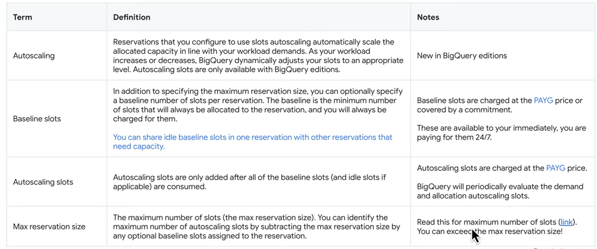

**BASELINE SLOTS**: Número mínimo de slots que sempre serão alocados à reserva, e você sempre vai ser cobrado por eles 24/7.

- **Podem ser encobridos por um commitment**. Por exemplo: se na minha reserva tenho 100 baseline slots rodando e simultaneamente tenho um commitment de 100 slots, o peço do commitment encobrirá o preço dos baseline slots

**AUTOSCALING SLOTS**: Slots que somente serão alocados depois que todos os baseline slots tiverem sido consumidos. Você paga por esses slots conforme usa.

- **O BigQuery escalona reservas por múltiplos de 100** até atingir o número de slots necessários para executar os jobs ou atingir o número máximo de slots disponíveis para a reserva.
- **Você é cobrado pelo número de slots escalonados, não pelo número de slots usados.** Essa cobrança será aplicada mesmo se o job que faz o BigQuery escalonar verticalmente falhar.

**MAX RESERVATION SIZE**: Número máximo de slots a serem utilizados. Por exemplo: Se você fez uma reserva máxima de 1000 slots, e 100 desses slots são baseline slots, os 900 slots restantes são autoscaling slots.

___

Os slots podem ser comprados em diferentes edições, entre elas:

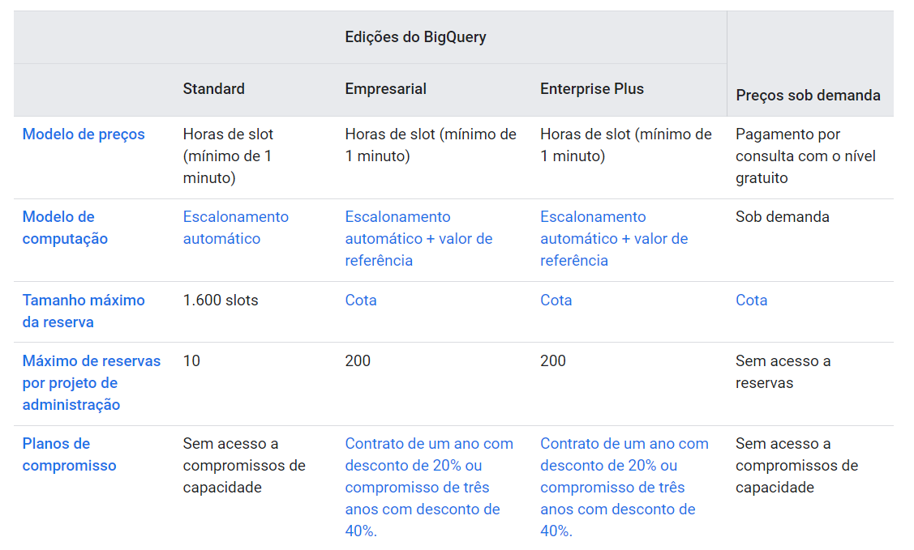

Existem mais fatores que diferenciam estas edições mas, em geral, segue-se a regra:

- Para projetos pequenos é recomendada a edição Standard
- Para projetos maiores, a edição Enterprise (Empresarial)
- Só se utiliza Enterprise Plus em situações muito específicas

# Compromissos

Compromissos de lots são slots *por assinatura*, onde você é cobrado por 1 ou 3 anos com um desconto no valor.

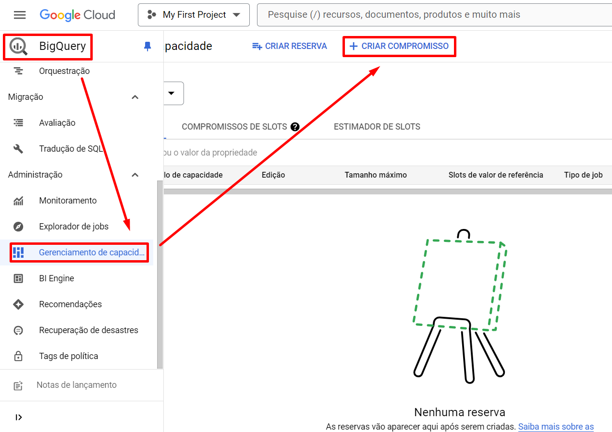

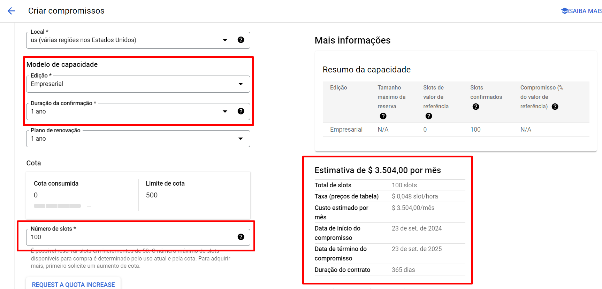

Como dito antes, os compromissos cobrem os valores dos slots de referência (baseline slots), oferecendo uma opção mais barata em relação aos baseline individuais. 

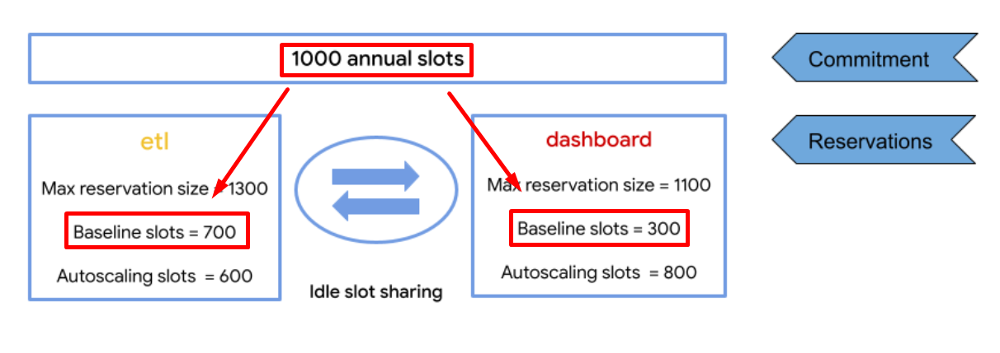

Nesse caso, os 1000 slots comprados via compromisso são distribuídos em: 700 no job etl / 300 no job dashboard.

Com a opção *Idle slot sharing* ativa, mesmo que os slots de compromisso estejam distribuídos entre os dois jobs apresentados, esses slots podem ser trocados entre si caso não estejam sendo utilizados.

    Para a reserva etl, o número máximo de slots possível é igual aos slots de referência etl (700), mais os slots de valor de referência dashboard (300, se todos os slots estiverem inativos), mais o número máximo de slots de escalonamento automático (600). Portanto, o número máximo de slots que a reserva etl pode usar neste exemplo é 1600.

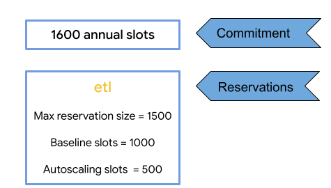

Nesse outro caso, nem todos os slots comprados via compromisso são alocados.

Porém mesmo assim os slots de autoscaling só serão utilizados depois que todos os slots baseline comprados via compromisso forem utilizados, ou seja, a capacidade total de slots a serem alocados nesse caso é:

- 1000 slots baseline
- 600 slots restantes do compromisso
- 500 slots autoscaling
  - 2100 no total

# Monitorar jobs utilizados / memória utilizada
```
SELECT
  project_id,
  job_id,
  reservation_id,
  EXTRACT(DATE FROM creation_time) AS creation_date,
  TIMESTAMP_DIFF(end_time, start_time, SECOND) AS job_duration_seconds,
  job_type,
  user_email,
  total_bytes_billed,

  -- Average slot utilization per job is calculated by dividing total_slot_ms by the millisecond duration of the job

  SAFE_DIVIDE(job.total_slot_ms,(TIMESTAMP_DIFF(job.end_time, job.start_time, MILLISECOND))) AS job_avg_slots,
  query,

  -- Determine the max number of slots used at ANY stage in the query.
  -- The average slots might be 55. But a single stage might spike to 2000 slots.
  -- This is important to know when estimating number of slots to purchase.

  MAX(SAFE_DIVIDE(unnest_job_stages.slot_ms,unnest_job_stages.end_ms - unnest_job_stages.start_ms)) AS jobstage_max_slots,

  -- Check if there's a job that requests more units of works (slots). If so you need more slots.
  -- estimated_runnable_units = Units of work that can be scheduled immediately.
  -- Providing additional slots for these units of work accelerates the query,
  -- if no other query in the reservation needs additional slots.

  MAX(unnest_timeline.estimated_runnable_units) AS estimated_runnable_units
FROM `region-us`.INFORMATION_SCHEMA.JOBS AS job
  CROSS JOIN UNNEST(job_stages) as unnest_job_stages
  CROSS JOIN UNNEST(timeline) AS unnest_timeline
WHERE project_id = 'my_project'
  AND statement_type != 'SCRIPT'
  AND DATE(creation_time) BETWEEN DATE_SUB(CURRENT_DATE(), INTERVAL 7 DAY) AND CURRENT_DATE()
GROUP BY 1,2,3,4,5,6,7,8,9,10
ORDER BY job_id;
```

A própria documentação do GCP fornece essa query, onde é possível visualizar, nas últimas consultas, métricas importantes como:

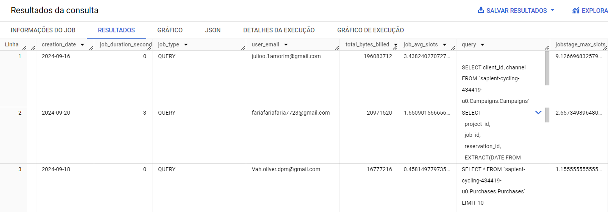

- Data em que o job foi realizado
- Duração do job em segundos
- Tipo do job
- **Bytes cobrados pelo job**
- **Média de slots alocados**
- **Número máximo de slots em determinada etapa do projeto**

# Diferenciando modelos de cobrança

A partir da consulta anterior, é possível analisar a forma de cobrança a ser escolhida.

Utilizar o modelo sob-demanda do BQ está intrinsicamente ligado à quantidade de dados processada continuamente pelo seu projeto.

**Em projetos pequenos com pouco volume de dados envolvido no processamento o modelo sob-demanda é essencial**:

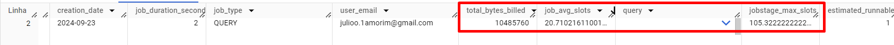

Já o modelo de capacidade de computação está intrinsicamente ligado ao uso de slots por job.

Queries de maior complexidade de processamento computacional exigem mais slots na sua execução. Quando se quer **mais capacidade de processamento** ou em casos em que **o volume de dados excede a capacidade computacional** o modelo de capacidade se mostra muito mais benéfico economicamente.

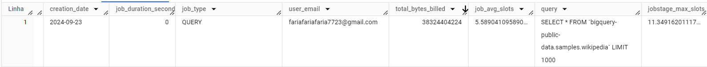

## Rotina para comparação de preços
Para uma exemplificação de caso onde os diferentes tipos de preço se destacam em relação aos outros:

Na nossa rotina ETL padrão, que geramos 4 `views` relacionadas às tabelas `Campaigns` e `Purchases`, o DataForm cobra 40MB (10MB de cada `view`) para cada execução da rotina.

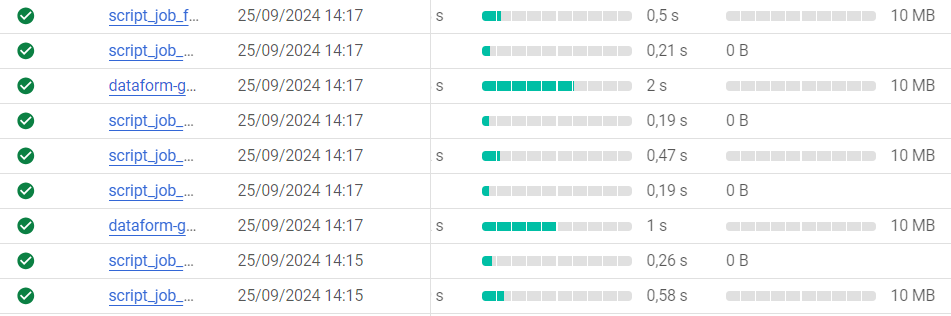

Se fôssemos utilizar o modelo sob-demanda do BQ para rodar esse job a cada 5 minutos durante 30 dias ininterruptos, por exemplo, pagaríamos por `345.600` GB consumidos, resultando em uma cobrança final de **$2,16 p/ mês** + o preço de armazenamento dos dados:

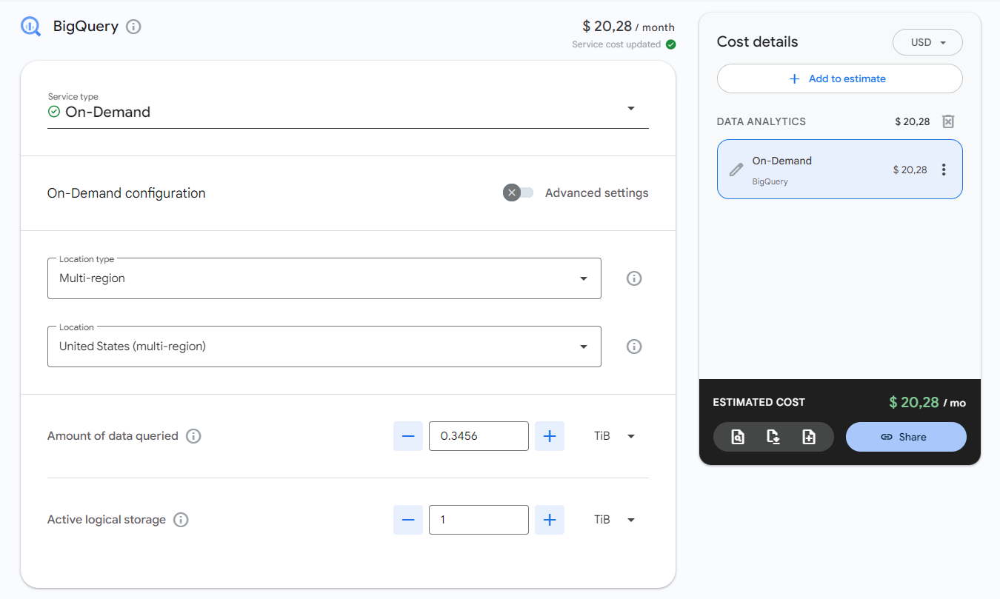

Se fôssemos utilizar o modelo por capacidade de computação, por outro lado:

- O job demora cerca de 1 seg para ser realizado:
  - A cobrança de slots é feita por, no mínimo, 1 min
  - Os slots são alocados de 100 em 100
  - Ou seja, para cada execução do job, o BQ cobra um minuto de 100 slots

- Preço do slot por hora: `$0,04`
  - Preço da hora de 100 slots: `$4`
  - Preço do minuto de 100 slots (o que vai ser cobrado por execução): `4 / 60 = $0,066`
  - Preço por hora executando a cada 5 min: `0,066 * 12 = $0,8`
  - Preço por dia: `0,8 * 24 = $19,2`

**Preço por mês: `19,2 * 30 = $576` + preço do storage**

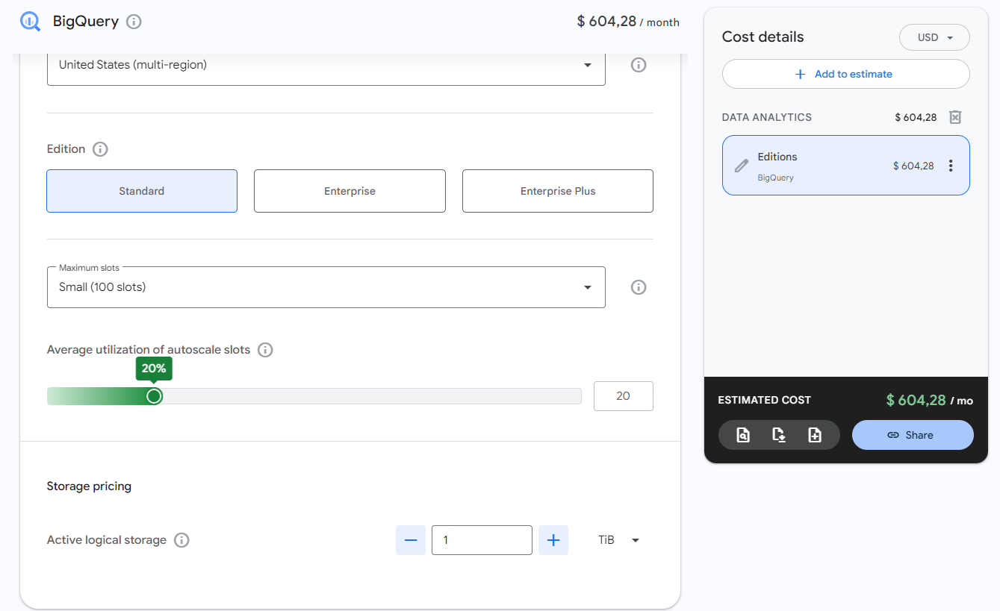

Nesse exemplo, seria muito inviável utilizar o modelo de cobrança sob capacidade de computação, por conta da baixa quantidade de dados processados por execução do job (onde o modelo sob-demanda seria muito mais benéfico).

___

Criamos posteriormente outra rotina exemplificando onde o modelo de capacidade de computação se mostraria menos custoso.

É uma rotina bem simples, que atualiza uma tabela realizando uma consulta de 36GB em uma tabela de amostras do BQ.

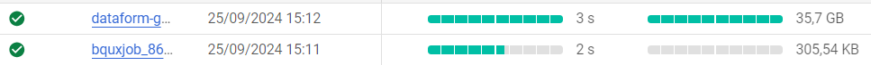

Se a mesma situação do exemplo anterior fosse replicada (onde o job seria executado a cada 5 min durante 5 dias ininterruptos) a cobrança, no modelo **sob-demanda**, seria sobre `36 * 12 * 24 * 30` = `311.040GB`.

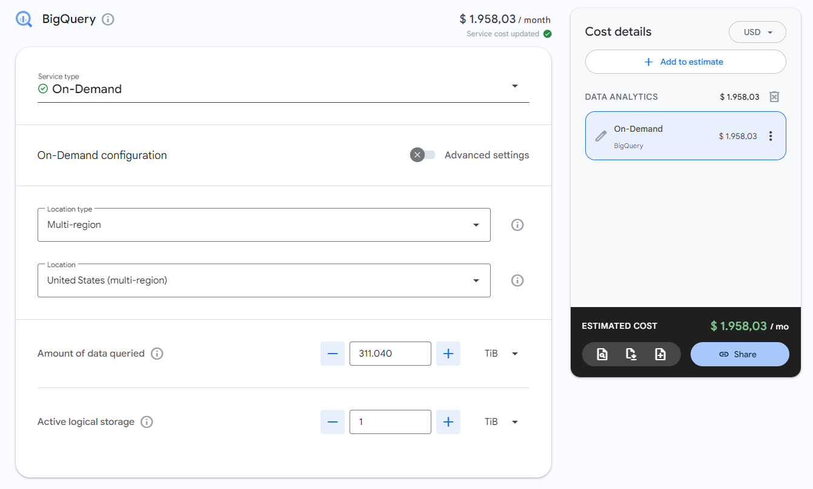

Porém, como o job continua utilizando menos de 100 slots, a cobrança acaba sendo a mesma do exemplo anterior!


Dessa forma, nesse caso, **comprar slots é duas vezes mais eficiente do que utilizar o modelo sob-demanda.**