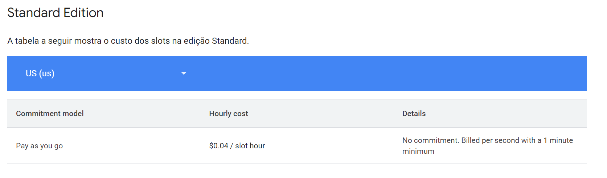
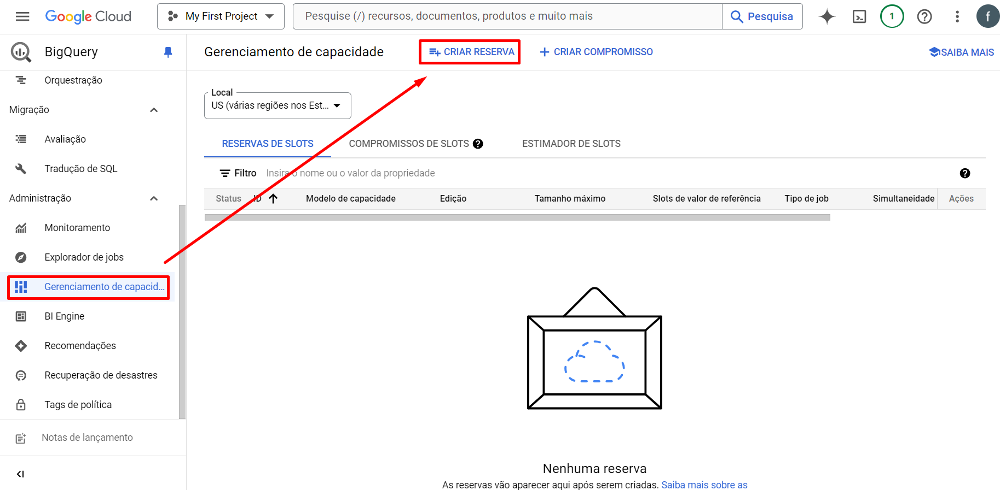
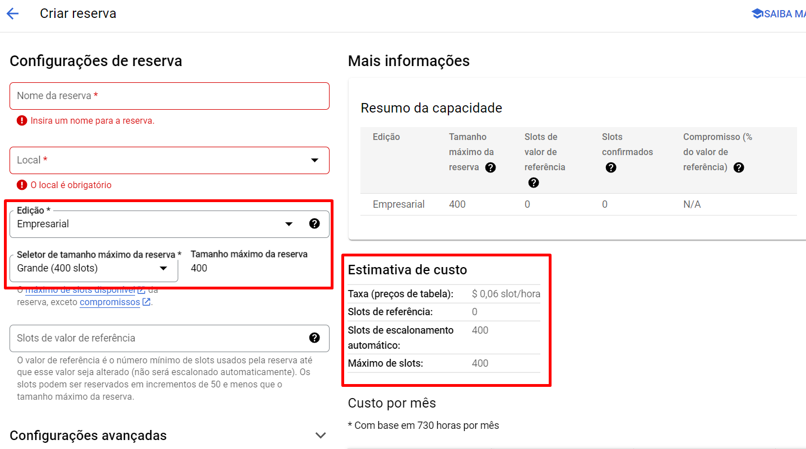
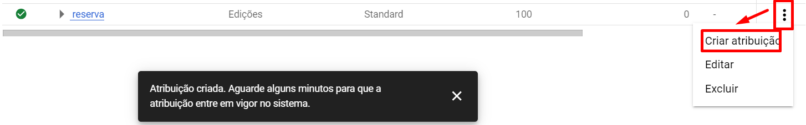
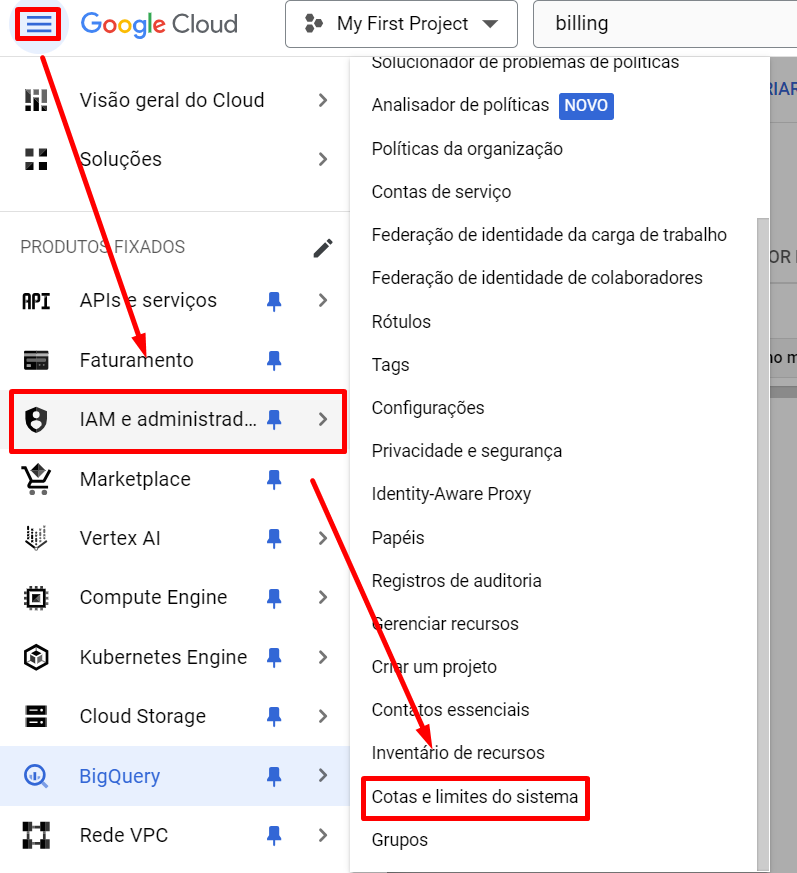
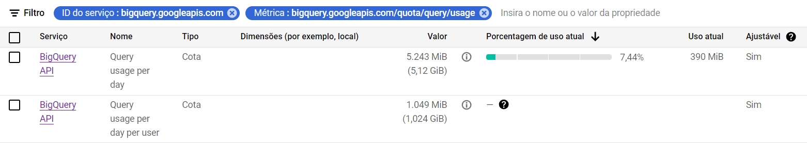
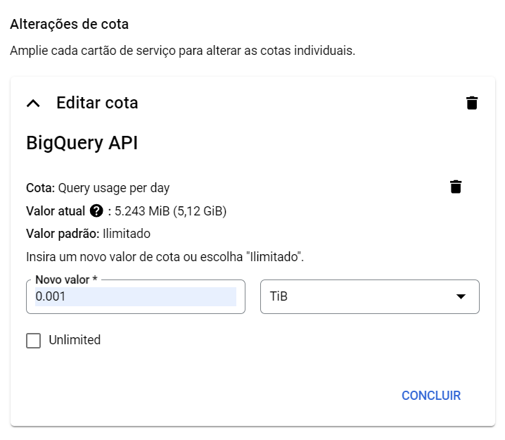

# BigQuery Pricing

Existem dois tipos de modelos de preços que governam os slots para processamento de dados:

- **Sob demanda** - O Google Cloud determina quantos slots serão necessários para cada consulta. Preço cobrado geralmente por TB utilizados.
  - PERIGO: Como os slots são sob demanda, se uma query imensa e desnecessária for executada, uma quantidade imensa de slots também serão puxados, resultando numa cobrança igualmente imensa. Isso pode ser revertido, de certa forma, aplicando cotas no máximo de bytes faturados por consulta, por exemplo.

- **Com base na capacidade** - Os clientes no modelo de preços com base na capacidade **escolhem explicitamente quantos slots reservar**. Suas consultas são executadas dentro dessa capacidade, e **você paga por essa capacidade continuamente a cada segundo que ela é implantada**. 
  - Por exemplo, se você comprar 2.000 slots do BigQuery, suas consultas agregadas serão limitadas a usar 2.000 CPUs virtuais a qualquer momento. Você tem essa capacidade até excluí-la e paga por 2.000 slots até excluí-los.
  - Isso pode resultar em uma consulta mais lenta: Por exemplo, se o Google Cloud determinar que 2000 slots serão necessários para realizar uma consulta, e sua organização só comprou 1000, sua consulta será parcialmente realizada nos primeiros 1000 slots e, conforme tais slots vão sendo liberados, realizam os outros 1000 que faltavam.

Um slot do BigQuery é uma **CPU virtual usada pelo BigQuery para executar consultas SQL**. 

Durante a execução da consulta, o BigQuery calcula automaticamente quantos slots são necessários, dependendo do tamanho e da complexidade da consulta.

**O modelo Sob demanda está sujeito a ser mais volátil, quando em relação a custos**. Em geral, vai depender da quantidade de dados processados por query e na frequência em que essas são executadas.

**Já o modelo com base na capacidade computacional tende a oferecer um preço mais fixo**, já que você compra e aloca manualmente os slots a serem utilizados nas queries. A cobrança é feita a cada segundo em que os slots são utilizados.

### Atribuições de reserva de slots
Com a API BigQuery Reservation, você compra slots dedicados (chamados **compromissos**), cria pools de slots (chamados **reservas**) e **atribui projetos**, pastas e organizações a essas reservas.

### Para criar uma reserva de slots

# Cotas
O GCP fornece um sistema de cotas e limites personalizados na aba de IAM. 

Com elas é possível limitar certos recursos do GCP a fim de evitar catástrofes e reduzir custos.

As cotas relacionadas ao BigQuery são definidas ao aplicar o ID na seção de filtros:

    bigquery.googleapis.com

Dentre as métricas mais importantes estão, por exemplo:

Nelas é possível alterar o quanto o projeto, ou um usuário, pode consumir - bytes - em consultas por dia.

Para realizar a alteração, basta clicar na cota desejada e um prompt com um botão **Editar** vai aparecer.

Na tela de edição basta desmarcar a opção **Unlimited** caso esteja marcada e passar o novo limite a ser definido. No exemplo acima, é definido o limite de 1GB para processamento diário de queries pelo projeto.

Caso o limite seja excedido, a seguinte mensagem aparecerá e o usuário deverá esperar até o próximo dia, quando o limite resetar.

# Dúvidas
Como acontece a cobrança do modelo sob capacidade computacional (comprando reserva de slots) ficou um pouco abstrato para mim. Não consegui ter certeza se o valor dos slots são cobrados continuamente ou só enquanto estão sendo usados para processar alguma query.