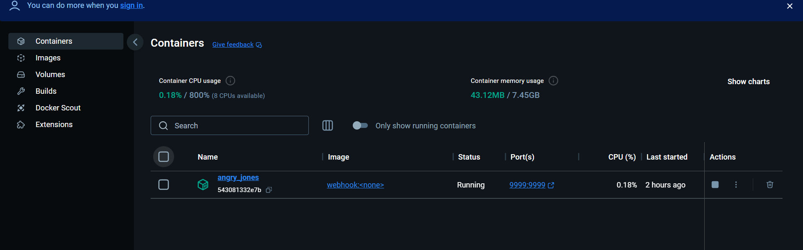
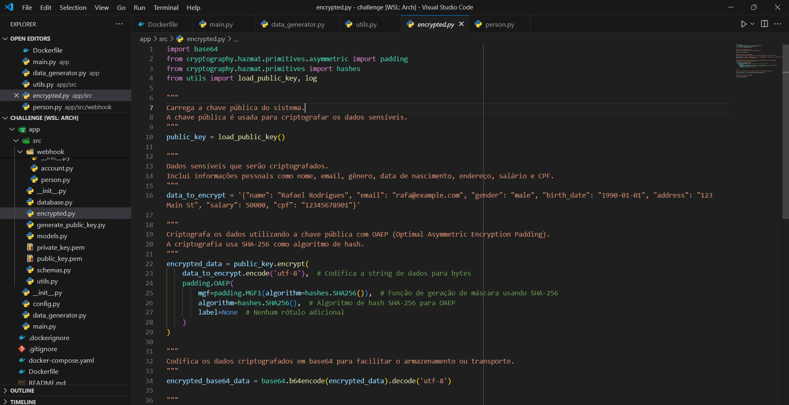
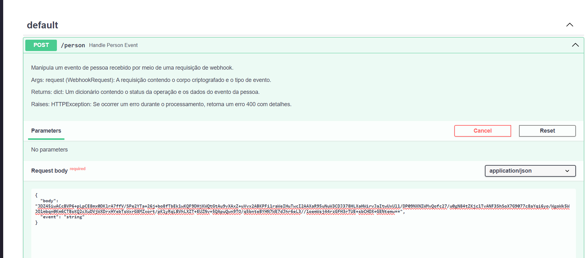
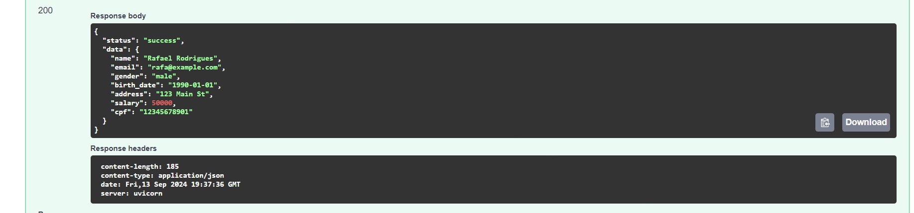

# Estudos do projeto da trilha de backend

## O que eu tô fazendo ?
Até o momento consegui desenvolver a rota person da minha api de webhook, que funciona enviando os dados de um cliente e esses dados em forma de criptografia é descriptografado para ser enviado ao serviço de mensageria. Também consegui subir minha aplicação para o docker e agora estou tentando implementar o docker compose para orquestrar os containers da minha aplicação. Também estou usando o gitflow para manter minhas branchs padronizadas e utilizando padrões de commit. 

Segue o passo a passo do funcionamento da minha API até o momento:

- consegui subir minha aplicação para o docker exposto na porta 9999

- Tenho uma função responsável por gerar dados de uma pessoa criptografada

- Com essa função eu posso pegar essa criptografia e passar para o ambiente de teste da minha api, que no caso tô usando o swagger disponível na própria fastAPI. 

- Após a execução tenho a resposta com os dados da pessoa descriptografado

## Dúvidas

Estou levando um tempo para pesquisar e entender o funcionamento do python pois essa é a primeira vez que trabalho com essa limguagem, tive problemas com import e rotas dos meus arquivos, o Docker também estou estudando o seu funcionamento e como usar na minha aplicação. 

