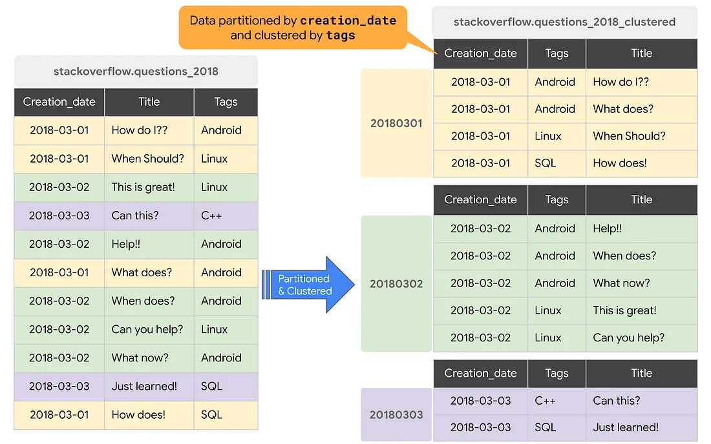

# Particionamento e Clustering

O particionamento e o clustering são essenciais para otimizar o armazenamento de dados, reduzir custos e acelerar a execução de consultas.

## Particionamento
O particionamento divide uma tabela em segmentos menores, facilitando tanto o gerenciamento quanto a consulta dos dados. Ele é usado principalmente para melhorar o desempenho quando as operações excedem limites ou quando é necessário estimar os custos de uma consulta.

**Tipos de Particionamento:**
- Por número inteiro
- Por unidade de tempo: `DATE`, `TIMESTAMP`, `DATETIME`
- Tempo de processamento: `_PARTITIONTIME`
- Diariamente, por hora, mensalmente ou anualmente.

## Clustering
O clustering organiza os dados de acordo com uma ordem de colunas definida pelo usuário. Isso permite que as consultas sejam mais eficientes, já que os dados são ordenados em grupos.

**Tipos de dados para clustering:**
- `STRING`
- `INT64`
- `NUMERIC`
- `BIGNUMERIC`
- `DATE`
- `DATETIME`
- `TIMESTAMP`
- `BOOL`
- `GEOGRAPHY`

## Combinação de Particionamento e Clustering
A combinação dessas técnicas permite uma organização ainda mais precisa dos dados, resultando em consultas otimizadas. Em tabelas particionadas, os dados são armazenados em blocos físicos, e o BigQuery utiliza os metadados para estimar melhor o custo das consultas. No entanto, à medida que o número de partições aumenta, a quantidade de metadados necessários também cresce.

O uso combinado de particionamento e clustering aprimora a eficiência e a precisão das consultas, organizando os dados de maneira que simplifica o processo de busca.

Para eu conseguir fazer o que foi solicitado que seria "Limitar e como usar partição e clustering", tive que criar um novo dataset, sem nenhuma configuração diferente, e nele criar a tabela nova.  

Na nova tabela, fiz upload do arquivo "Purchases_2023"

No esquema coloca para "Detectar automaticamente", pois quando fui adicionar manualmente estava dando erro ao criar a tabela. 

### Configuração de Particionamento:
- **Tipo de particionamento:** `Partição por tempo de processamento`, organizando os dados conforme o momento de processamento.
- **Filtro de particionamento:** Selecionei a exigência da cláusula `WHERE`, o que ajuda a reduzir custos e melhorar o desempenho.
- **Particionamento diário:** Foi escolhido para permitir consultas rápidas.

- **Ordem de clustering:** A coluna `purchase_datetime` foi usada para otimizar a busca e filtragem, facilitando consultas rápidas.

Para verificar se uma tabela está particionada e usa clustering, acesse as "Detalhes" da tabela. No campo "Tipo de tabela", você verá "Agrupado por", indicando as colunas de clustering.

Para testar o código de particionamento abri uma janela e adicionei o seguinte código 

~~~~

SELECT
purchase_datetime
FROM 
`test_cluestering.clustering_test`
WHERE
 _PARTITIONTIME > TIMESTAMP_SUB(TIMESTAMP('2023-08-02'), INTERVAL 10 DAY)
~~~~
Resultado

## Citações 
 * O poder do bigquery com particionamento e clustering <https://medium.com/@nayyarabernardo/o-poder-do-bigquery-com-particionamento-e-clustering-89d1bfe17549>
 * Introdução a tabelas particionadas
 <https://cloud.google.com/bigquery/docs/partitioned-tables?hl=pt-br>
 * Introdução às tabelas em cluster
 <https://cloud.google.com/bigquery/docs/clustered-tables?hl=pt-br>
* Partitioning and Clustering in Google BigQuery for beginners
<https://www.youtube.com/watch?v=4b1l17qdc4Y>
* Optimize with partitioning and clustering
<https://www.cloudskillsboost.google/paths/31/course_templates/54/video/436826?locale=pt_BR>

## Dúvida

Como poderia fazer alguma consulta que realmente ajude e como poderia usar o cluster.