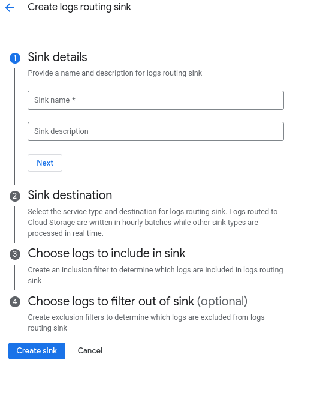

# Sincronizando e Monitorando Logs no BigQuery via Google Cloud Platform (GCP)

## Passos:

1. **Criar Dataset e Tabela no BigQuery**
   - Acessei o console do BigQuery.
   - Criei um dataset e uma tabela para armazenar os logs. (No caso já havia utilizado um dataset/table que já existia o campaign e purchases)

2. **Habilitar o Cloud Logging**
   - Ative o Cloud Logging nos serviços que você deseja monitorar (App Engine, Compute Engine, Kubernetes, BigQuery.)

3. **Configurar um Sink no Cloud Logging**
   - No "Logs Router", crie um sink.
   - Defina um nome para o sink.
   - Escolha o BigQuery como destino.
   - Selecione o dataset criado no passo anterior. (campaign e purchases)
   - 

4. **Configurar Filtros e Permissões**
   - Adicione filtros para exportar logs específicos, se necessário.
   - Ajuste as permissões necessárias para permitir o envio dos dados. (Existem maneiras de filtrar logs específicos, os quais eu quero filtrar... Estou vendo isso)

5. **Monitoramento e Consulta dos Logs**
   - Assim que o sink estiver configurado, os logs serão exportados automaticamente para o BigQuery.
   - Você poderá consultar os logs via SQL no BigQuery. (serão criados tables dentros dos datasets, vários de logging)

6. **Visualização com Google Data Studio ou Grafana**
   - Integre os dados com o Google Data Studio ou Grafana.
   - Crie queries personalizadas para obter insights em tempo real. (Grafana é muito caro para a nossa realidade, sobrou apenas o Google Data Studio, no qual é bem ruim de ser usado... Estou vendo como posso melhorar isso)
