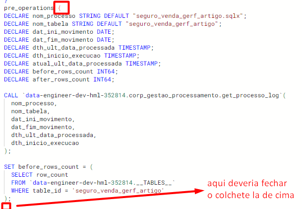
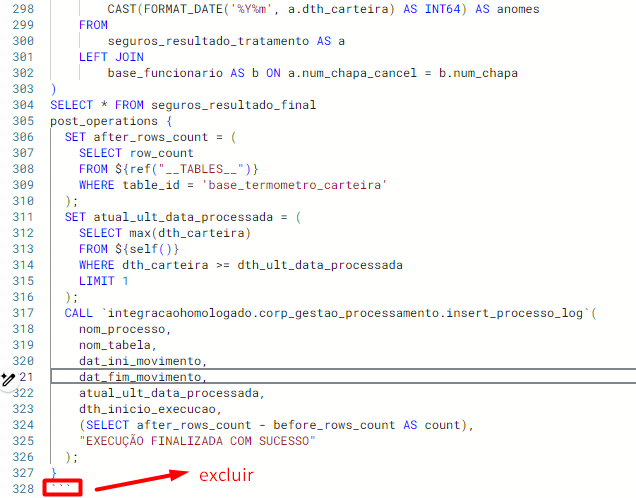
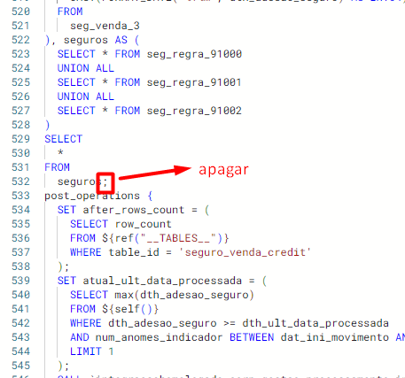
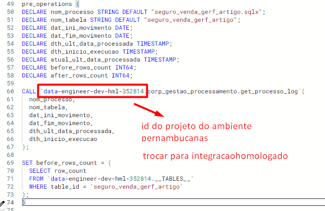

# Erros de sintaxe mais comuns no dataform

## Unexpected identifier "post_operations"
Esse erro ocorre pela falta de fechar colchetes em alguma parte do código, muito possivelmente no _pre operations_ no começo do script:

## Invalid empty identifier
Ocorre pela presença de ''' em alguma parte do código (geralmente la no final do script):

## Semi-colons are not allowed at the end of SQL statements
Ocorre pela presença de ; no script (geralmente no final da consulta, antes do _post operations_):

## User does not have permission to invoke routine 
Ocorre porque o script está tentando acessar uma rotina que não tem permissão ou não existe naquele ambiente.

No nosso caso, os scripts vêm com o id do projeto do ambiente da pernambucanas junto com as rotinas, porém trabalhamos em outro ambiente de testes, com outro id de projeto.

Portanto, para solucionar, encontrar onde o script chama a rotina e alterar o id do projeto (provavelmente vai estar como **data-engineer-dev-hml-352814**) para a id do nosso projeto: **integracaohomologado**.

OBS: as rotinas são chamadas no *pre operations* e no *post operations*.

# Erros comuns no BigQuery

**LEMBRANDO**

Antes de começar a corrigir os erros de lógica no BQ, deve-se primeiro remover as referenciações do DataForm:

    ${ref('pfs_pfin_termometro', 'tabela')}

Para o modelo de referenciação padrão do BQ:

    `pfs_pfin_termometro.tabela`

Além disso, trocar toda ocorrência de **dat_ini_movimento** e **dat_fim_movimento** para, respectivamente, a data de dois dias anteriores e um dia anterior à consulta.

Isso se dá pelo motivo do BQ não conseguir processar as variáveis que o script utiliza no DataForm.

## Unrecognized name: nome_da_coluna
Esse erro se dá por tentar consultar uma coluna não existente.
Nesse caso, comentar a linha em que a coluna é consultada e eu passo pro Rafão como prosseguir.