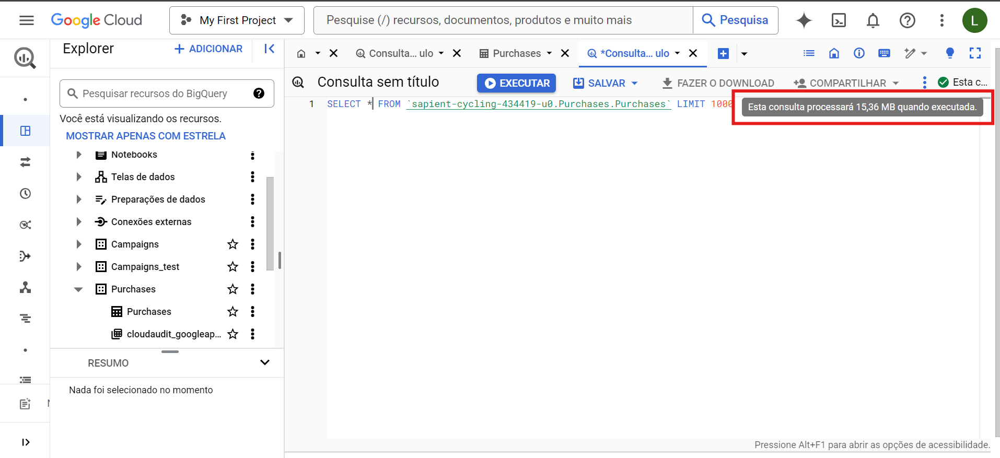
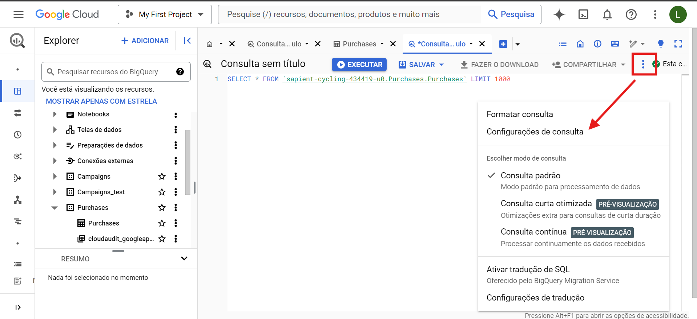
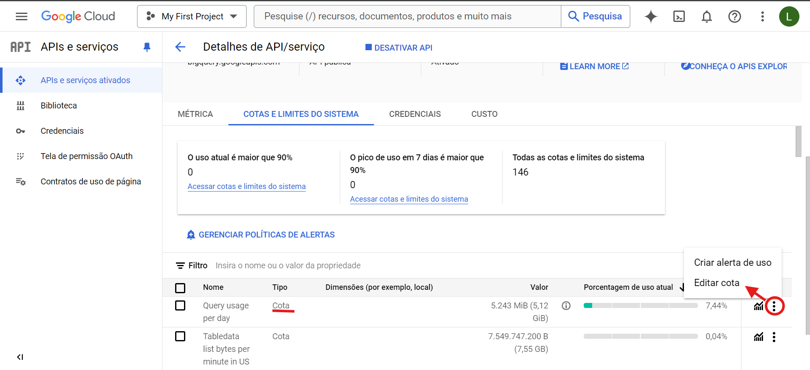

## Gerenciamento de memória por usuário nominal e de serviço no BigQuery. 💻📊

✅ **Teste que deu certo**:

### Reduzir o número de Bytes por consulta
- Entrar no seu projeto do BigQuery;
- Abrir uma tabela para fazer alguma consulta;
- Entrar na configuração da consulta e limitar o número de bytes cobrados. 

Com esses passos acima, assim que algum usuário executar uma consulta acima do limite elá dará um erro e não seguirá com a consulta. 

**Ex.**: 

🔎 **Outra possível opção**:

### Reduzir o valor da cota
- APIS e serviços ativados ou pelo IAM;
- Filtrar pelo serviço que deseja (no caso BigQuery);
- Cotas e limites do sistema ;
- Selecionar e colocar o valor da cota que deseja.

**Ex.**: 

📚 **Link das documentações utilizadas**:

- [Cotas e Limites](https://cloud.google.com/bigquery/quotas?hl=pt_br)

- [Restringir o número de Bytes](https://cloud.google.com/bigquery/docs/best-practices-costs?hl=pt-br#restrict-bytes-billed)

### Dúvidas

- Saber se essa forma é a correta para seguir ou se tem uma maneira melhor

- Na parte de IAM tem uma parte das cotas que aparece várias regiões, teria alguma maneira de deixar um projeto em apenas uma região específica para aplicas as cotas?

- Dificuldade de achar documentação e vídeos para o assunto específico