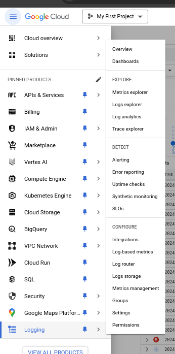
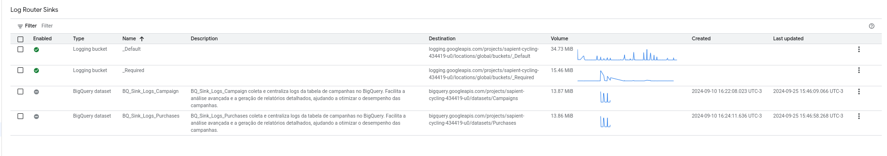
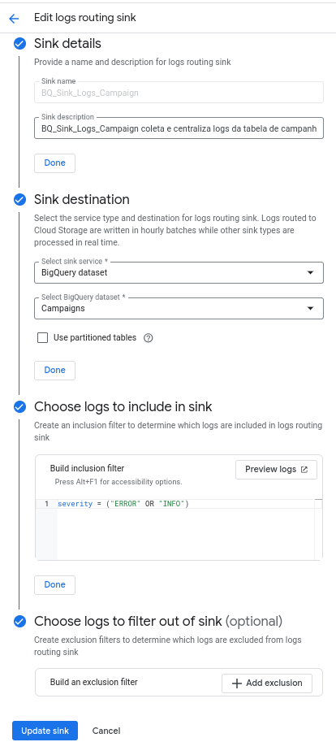

## 1. Criação do Sink

- Acesse o **Google Cloud Console**.
- No menu lateral, vá até a seção **Logging** e clique em **Logs Router**.
- Inicie a criação de um novo **sink**, nomeando-o como `BQ_Sink_Logs_Campaign`.
- No campo de destino, selecione **BigQuery** e escolha o conjunto de dados chamado `Campaigns`, onde os logs serão armazenados.

Essa configuração vai permitir que os logs da sua aplicação sejam enviados diretamente para o BigQuery, garantindo que todos os dados fiquem centralizados e acessíveis para futuras consultas e análises.

## 2. Coletar Logs de Erro e Informações

- Defina o sink para coletar logs de **erro** e **informações** de sua aplicação.
- A coleta de ambos os tipos de logs é importante para proporcionar uma visão completa, permitindo que erros críticos sejam detectados rapidamente e que dados informativos auxiliem na análise de desempenho.

Com essa abordagem, você conseguirá monitorar tanto falhas quanto o comportamento geral da aplicação, facilitando a identificação de problemas ou otimizações necessárias.

## 3. Usar Tabelas Particionadas

- Ao configurar o sink, habilite o uso de **tabelas particionadas** por data.
- Tabelas particionadas organizam os logs de forma eficiente, permitindo que as consultas sejam realizadas em datas específicas, o que melhora significativamente o desempenho em consultas de grandes volumes de dados.

Essa funcionalidade é especialmente útil quando se trata de logs que crescem em escala, garantindo que o sistema permaneça rápido e gerenciável.