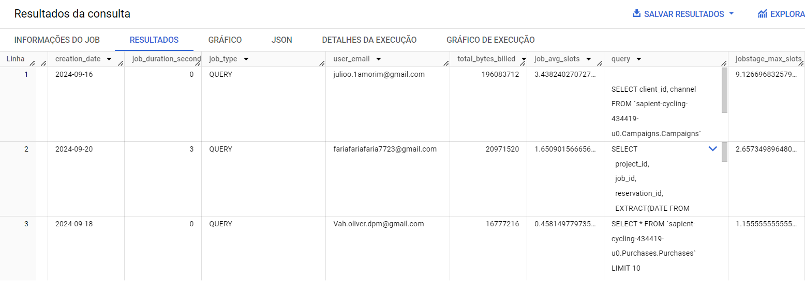
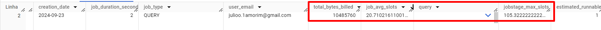
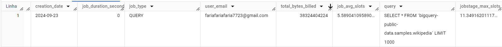
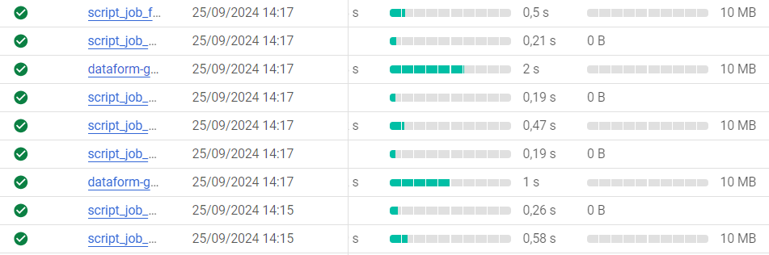
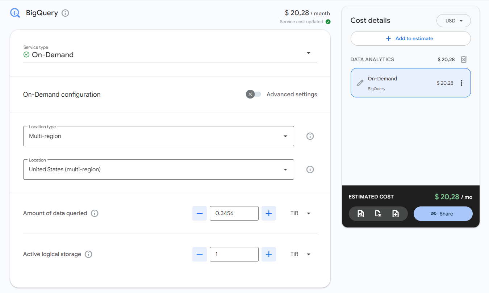
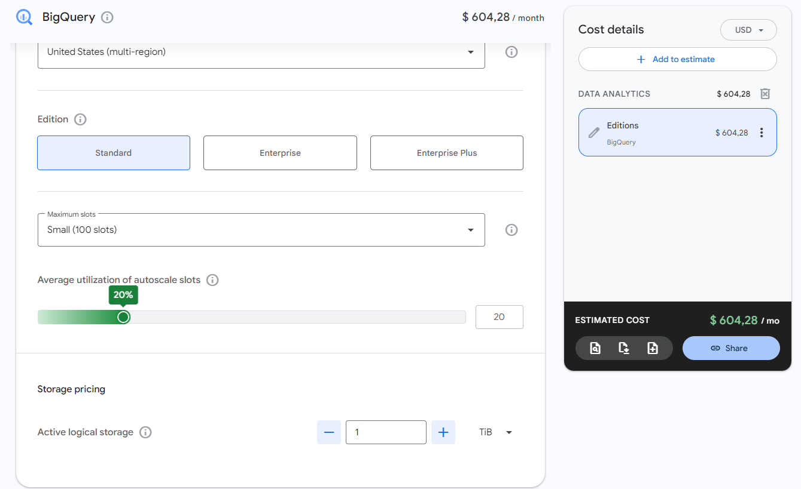
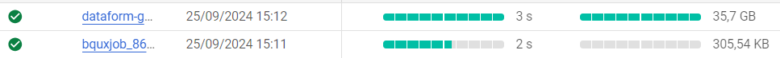
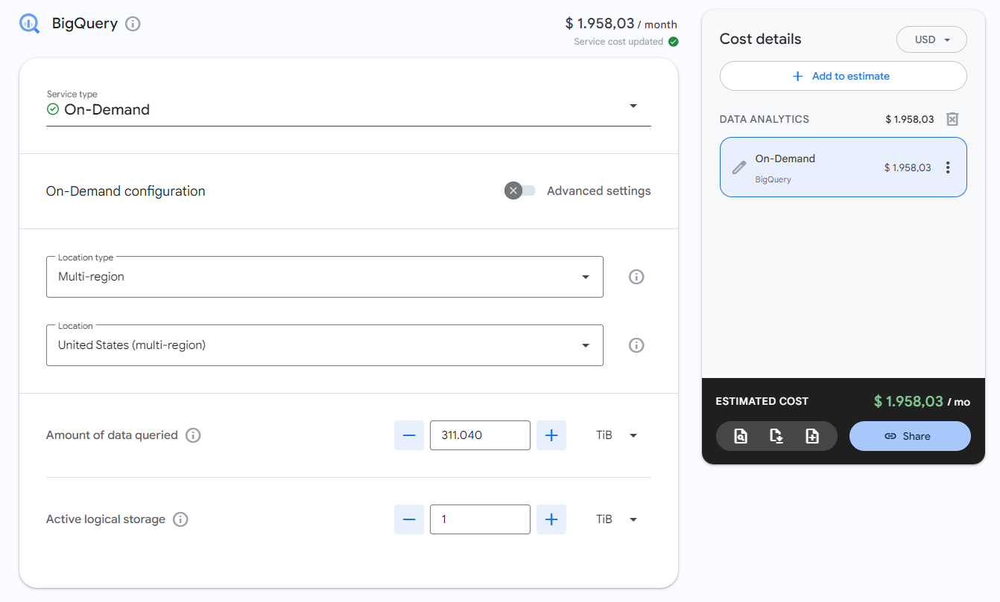
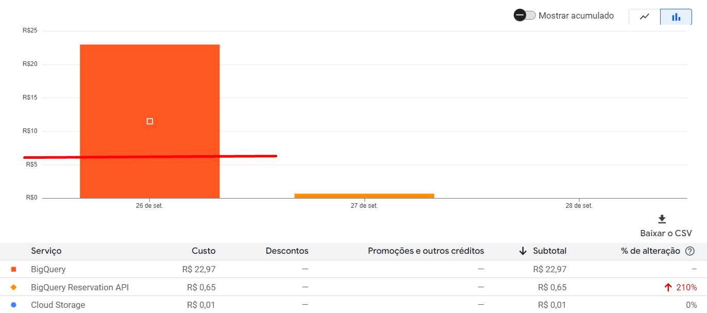

# Validando preços do BigQuery
A própria documentação do GCP fornece essa query, onde é possível visualizar, nas últimas consultas, métricas importantes como:



- Data em que o job foi realizado
- Duração do job em segundos
- Tipo do job
- **Bytes cobrados pelo job**
- **Média de slots alocados**
- **Número máximo de slots em determinada etapa do projeto**

## Diferenciando modelos de cobrança

A partir da consulta anterior, é possível analisar a forma de cobrança a ser escolhida.

Utilizar o modelo sob-demanda do BQ está intrinsicamente ligado à quantidade de dados processada continuamente pelo seu projeto.

**Em projetos pequenos com pouco volume de dados envolvido no processamento o modelo sob-demanda é essencial**:



Já o modelo de capacidade de computação está intrinsicamente ligado ao uso de slots por job.

Queries de maior complexidade de processamento computacional exigem mais slots na sua execução. Quando se quer **mais capacidade de processamento** ou em casos em que **o volume de dados excede a capacidade computacional** o modelo de capacidade se mostra muito mais benéfico economicamente.



## Rotina para comparação de preços
Para uma exemplificação de caso onde os diferentes tipos de preço se destacam em relação aos outros:

Na nossa rotina ETL padrão, que geramos 4 `views` relacionadas às tabelas `Campaigns` e `Purchases`, o DataForm cobra 40MB (10MB de cada `view`) para cada execução da rotina.



Se fôssemos utilizar o modelo sob-demanda do BQ para rodar esse job a cada 5 minutos durante 30 dias ininterruptos, por exemplo, pagaríamos por `345.600` GB consumidos, resultando em uma cobrança final de **$2,16 p/ mês** + o preço de armazenamento dos dados:



Se fôssemos utilizar o modelo por capacidade de computação, por outro lado:

- O job demora cerca de 1 seg para ser realizado:
  - A cobrança de slots é feita por, no mínimo, 1 min
  - Os slots são alocados de 100 em 100
  - Ou seja, para cada execução do job, o BQ cobra um minuto de 100 slots

- Preço do slot por hora: `$0,04`
  - Preço da hora de 100 slots: `$4`
  - Preço do minuto de 100 slots (o que vai ser cobrado por execução): `4 / 60 = $0,066`
  - Preço por hora executando a cada 5 min: `0,066 * 12 = $0,8`
  - Preço por dia: `0,8 * 24 = $19,2`

**Preço por mês: `19,2 * 30 = $576` + preço do storage**



Nesse exemplo, seria muito inviável utilizar o modelo de cobrança sob capacidade de computação, por conta da baixa quantidade de dados processados por execução do job (onde o modelo sob-demanda seria muito mais benéfico).

___

Criamos posteriormente outra rotina exemplificando onde o modelo de capacidade de computação se mostraria menos custoso.

É uma rotina bem simples, que atualiza uma tabela realizando uma consulta de 36GB em uma tabela de amostras do BQ.



Se a mesma situação do exemplo anterior fosse replicada (onde o job seria executado a cada 5 min durante 5 dias ininterruptos) a cobrança, no modelo **sob-demanda**, seria sobre `36 * 12 * 24 * 30` = `311.040GB`.



Porém, como o job continua utilizando menos de 100 slots, a cobrança acaba sendo a mesma do exemplo anterior!


Dessa forma, nesse caso, **comprar slots é duas vezes mais eficiente do que utilizar o modelo sob-demanda.**

## Resultados



# **Tagueamento de processos Dataform**

Adicionando tags dentro do arquivo .sqlx:

Entrar no arquivo sqlx, e no cabeçalho na parte "configs" atribuir uma tag
(Você pode atribuir tags a vários arquivos sqlx)


É possível rodar as consultas de arquivos sqlx através da tag atribuida, criando um fluxo de trabalho no Dataform.


Na aba "Workflow Execution Logs", é possível ver o histórico de fluxos de trabalho do Dataform


O tagueamento de processos Dataform no GCP é uma prática útil para organizar e gerenciar pipelines de dados. Ele permite:

Rastreamento: Tags ajudam a identificar e rastrear facilmente etapas e tabelas do pipeline, facilitando a depuração e o monitoramento.
Governança de dados: Classificar processos por importância, sensibilidade ou compliance, garantindo conformidade com regulamentações.
Custo e performance: Atribuir tags de custo a processos para otimizar o uso de recursos e monitorar gastos.
Automação: Facilitar a automação de processos baseados em tags, como acionamento de alertas ou relatórios.


# **Particionamento e Clustering no BigQuery**

**Particionamento** divide a tabela em segmentos menores (por data, número ou tempo de processamento), acelerando consultas e facilitando o gerenciamento.  
**Clustering** organiza os dados em colunas especificadas, melhorando a eficiência das consultas. A combinação de ambos otimiza o desempenho e reduz custos.

## Passo a Passo no BigQuery

1. **Criar Dataset e Tabela**:  
   Crie um dataset e faça upload do arquivo de dados (ex.: "Purchases_2023"). No esquema, use "Detectar automaticamente".

2. **Configurar Particionamento**:  
   Escolha particionamento por data ou tempo de processamento (`_PARTITIONTIME`) e exija a cláusula `WHERE` para filtrar dados e melhorar desempenho.

3. **Configurar Clustering**:  
   Selecione uma coluna (ex.: `purchase_datetime`) para organizar e otimizar as consultas.

4. **Verificar Configuração**:  
   Veja os "Detalhes" da tabela para confirmar o particionamento e clustering.

5. **Testar Consulta**:  
   Execute consultas com particionamento e clustering:
   ```sql
   SELECT purchase_datetime
   FROM `test_clustering.clustering_test`
   WHERE _PARTITIONTIME > TIMESTAMP_SUB(TIMESTAMP('2023-08-02'), INTERVAL 10 DAY)


## Obrigatoriedade de Particionamento e Cluster

### Contexto

O objetivo da task era implementar uma obrigatoriedade de particionamento e clustering nas tabelas no BigQuery, garantindo que todas as novas tabelas criadas seguissem essas práticas recomendadas para otimização de performance e custos.

### Limitações Encontradas

Após análise das ferramentas disponíveis no GCP, especificamente no IAM (Identity and Access Management), identifiquei que:

- O método de controle de acesso por IAM permite criar políticas personalizadas, mas não há uma forma direta de negar a criação de tabelas sem particionamento e clustering sem a criação de **políticas personalizadas específicas**.
- Essas políticas personalizadas requerem que a organização tenha uma estrutura de **políticas de governança centralizadas**, o que só é possível quando o projeto está vinculado a uma **Organização** no GCP.
- **Atualmente, nosso projeto não está associado a uma Organização no GCP**, o que inviabiliza a aplicação das políticas personalizadas neste momento.

### Solução Proposta

Enquanto a estrutura de Organização no GCP não está disponível, é inviável a criação de uma política que impeça a criação de tabelas sem particionamento e clustering. No entanto, abaixo está o passo a passo de como o processo será feito assim que tivermos a Organização configurada.

#### Passo a Passo Futuro

1. **Configuração das Permissões de IAM**:
   - Atribuir permissões específicas aos administradores e usuários com base em papéis predefinidos e personalizados.
   - Garantir que apenas usuários com permissões apropriadas possam criar tabelas sem particionamento ou clustering (caso seja absolutamente necessário).

2. **Criação de Políticas de IAM Personalizadas**:
   - Criação de políticas personalizadas de IAM que neguem explicitamente a criação de tabelas que não tenham particionamento e clustering configurados.

## Políticas De Alertamento

- As políticas de alerta de "Bytes Escaneados por Consulta" no Google Cloud são mecanismos que ajudam a monitorar e gerenciar o uso de recursos de consulta no BigQuery. Elas permitem que administradores definam limites personalizados de bytes escaneados para consultas individuais, ajudando a controlar custos e garantir eficiência. Quando uma consulta ultrapassa o limite estabelecido, um alerta é disparado, permitindo ajustes em tempo real. A criação dessas políticas oferece maior visibilidade sobre o uso de dados, promovendo a otimização de desempenho e a prevenção de gastos excessivos com processamento de grandes volumes de dados.

### Criação Das Politicas De Alerta Bytes Escaneados Por Consulta
A criação de políticas de alerta para "Bytes Escaneados por Consulta" no Google Cloud é importante por várias razões:

 - Controle de custos: Ajuda a evitar gastos inesperados, alertando quando consultas escaneiam grandes volumes de dados, o que pode gerar custos altos.
- Otimização de desempenho: Força a revisão de consultas ineficientes, incentivando a melhoria de sua estrutura e uso de recursos.
- Previsibilidade orçamentária: Com alertas em vigor, equipes podem prever e gerenciar melhor o orçamento destinado a análises e processamento de dados.
- Governança e compliance: Ajuda a garantir que as práticas de uso de dados estejam em conformidade com políticas internas e regulamentações externas.

## Criação Da Politica De Alerta Por Custo
 

 

 

 