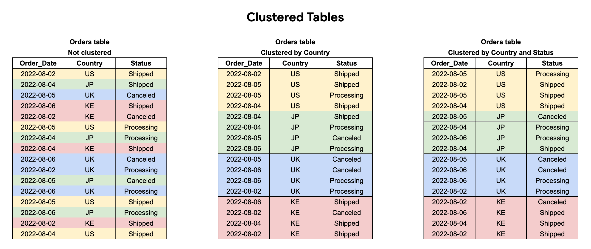
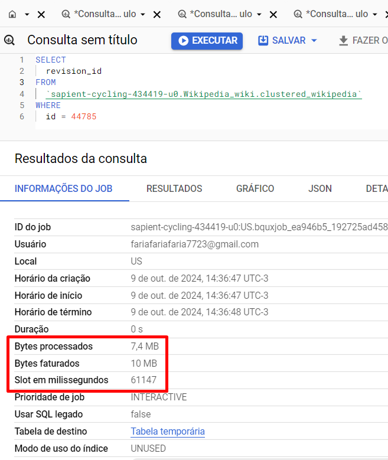

# Clusterização
Culsterizar uma tabela siginifica **ordenar uma tabela de acordo com determinadas colunas**. Até 4 colunas podem ser denominadas para a clusterização.

    As consultas que filtram ou agregam pelas colunas em cluster só verificam os blocos relevantes com base nas colunas em cluster, e não em toda a tabela ou na partição da tabela.
    - GCP

Como resultado disso, o BigQuery talvez não estime com precisão os bytes processados pela consulta, pois não sabe procurar na tabela como um todo, apenas nas subdivisões geradas pelo clustering. Porém, em contrapartida, **otimiza muito a execução e o custo da consulta**:

    O BigQuery classifica os dados em uma tabela em cluster com base nos valores atuais nas colunas em cluster e os organiza em blocos.

    Quando você executa uma consulta em uma tabela em cluster e a consulta inclui um filtro nas colunas em cluster, o BigQuery usa a expressão de filtro e os metadados do bloco para remover os blocos verificados pela consulta.
    - GCP

## Otimizando as consultas com clustering
No exemplo a seguir, a tabela de pedidos é agrupada usando uma ordem de classificação de colunas de Order_Date, Country e Status. Uma consulta que filtra Order_Date e Country é otimizada para clustering, mas uma consulta que filtra apenas Country e Status não está otimizada. 

**Para otimizar os resultados em clustering, é preciso filtrar das colunas em cluster para começar a partir da primeira coluna em cluster:**

## Exemplo de otimização de custos com clustering
Realizamos - com o fito de exemplificar - a mesma consulta na mesma tabela de 36GB de dados quando está não-clusterizada e quando está clusterizada:

### Consulta na tabela não-clusterizada:

A consulta custou 4,68GB de dados e consumiu a média de 53,549 slots

### Consulta na tabela clusterizada

A consulta custou, dessa vez, apenas 10MB que, quando em comparação com a outra consulta, apresentou 468x menos custos

    4,68GB / 0,01GB = 468

A consulta utilizou em média 1,028 slots, apresentando uma redução de 52X quando em comparação com a consulta anterior

    53,549 / 1,028 = 52,09