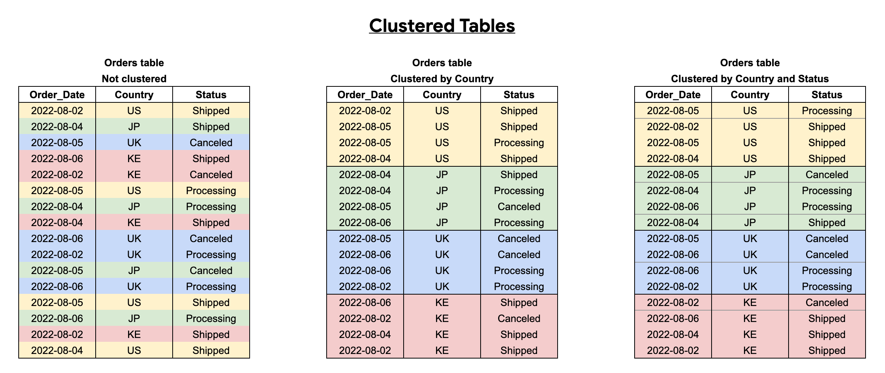
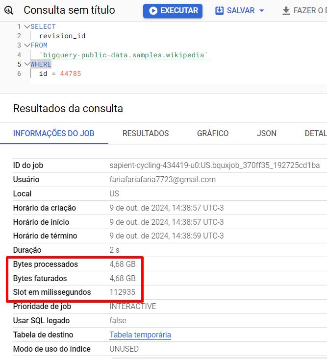
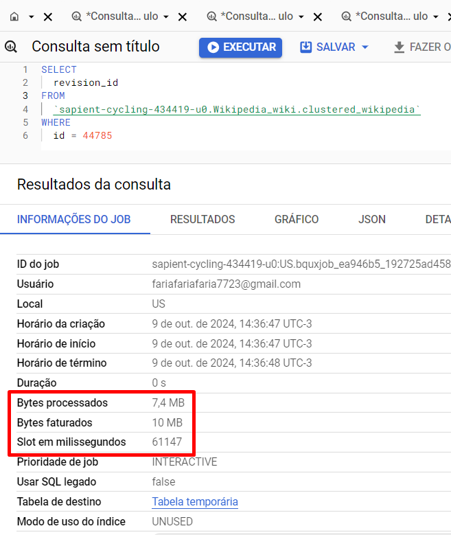
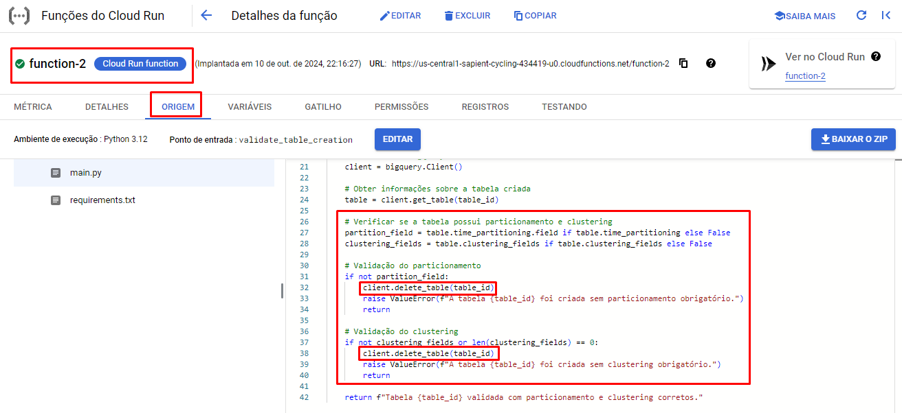
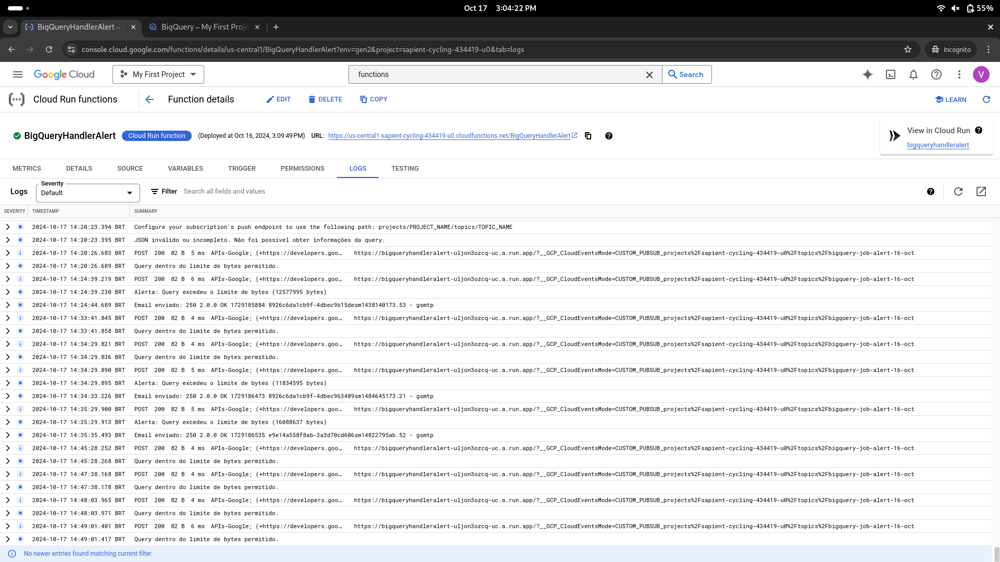
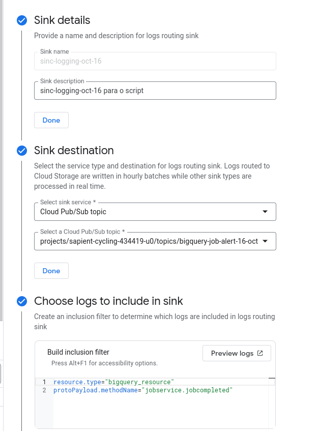
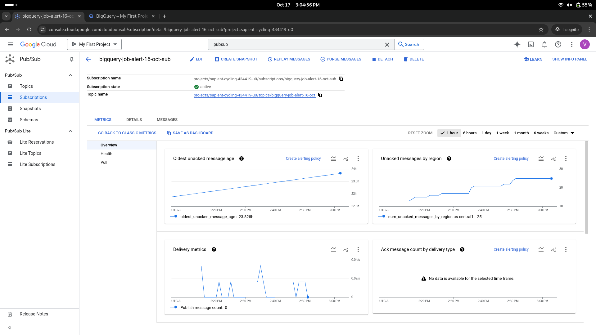

# Limite de retrocesso de tempo de particionamento por consulta

Uma das maneiras de limitar o usuário de realizar determinadas queries é criando uma função UDF (User Defined Function) no BigQuery, vou mostrar como fiz:

*1º passo: Encontrar a tabela particionada no BigQuery e criar uma consulta em nova guia*


*2º passo: Executar o seguinte script para criar uma função de validação*

[Execute este script](/Sprints/SP02-1410/Julio/Script/UDF.sql)

Será criado uma função, dentro de Rotinas que não permite ao usuário executar uma query que englobe um período maior que 2 meses

---------------------------------------------------------------------------------------------------

*Testando na prática*


Nesse caso retorna erro pois o intervalo de tempo é maior que 2 meses


Nesse caso a consulta é realizada com sucesso pois o intervalo é menor ou igual a 2 meses

---------------------------------------------------------------------------------------------------


Outra maneira de limitar o usuário de realizar queries é criando uma VIEW direto no DataForm do BigQuery.

**1º passo**: Entrar no BigQuery e selecionar o DataForm para criar a view, clicar em novo arquivo, colocar o nome que desejar e criar o arquivo


**2º passo**: configure sua view com o Tipo, Schema e Descrição. Após isso, colocar o código da consulta. 


```
-- Início da consulta que será utilizada pela view
SELECT *  -- Seleciona todas as colunas da tabela
FROM sapient-cycling-434419-u0.Purchases.teste_Purchases -- Define a tabela específica de onde os dados serão extraídos

-- Filtra as compras realizadas dentro de um intervalo de 60 dias
WHERE TIMESTAMP_TRUNC(purchase_datetime, DAY)  -- Trunca a data de compra para considerar apenas a parte do dia (ignorando horas e minutos)
  BETWEEN TIMESTAMP_SUB(TIMESTAMP("2023-10-13"),  -- Define o final do intervalo como 13 de outubro de 2023
  INTERVAL 60 DAY)  -- Subtrai 60 dias a partir de 13 de outubro de 2023 para definir o início do intervalo
  AND TIMESTAMP("2023-10-13")  -- Define o final do intervalo como exatamente o dia 13 de outubro de 2023

```

A partir desse código, será criado a view da minha tabela particionada com a limitação de apenas 2 meses.

---------------------------------------------------------------------------------------------------

*Execute o seguinte script para testar a validação*

[Execute esse script para teste](leticia/script/query.sql)

Com o script acima trará o seguinte resultado:


Com isso, podemos ver que a query foi bem sucedida trazendo os dados desde o dia 13/10 até o dia 14/08 (total de 02 meses).

---------------------------------------------------------------------------------------------------

**Comparação de bytes processados e faturados entre uma tabela e uma view particionada com o limite**

*Na tabela:*


---------------------------------------------------------------------------------------------------

*Na view:*


# Clusterização
Culsterizar uma tabela siginifica **ordenar uma tabela de acordo com determinadas colunas**. Até 4 colunas podem ser denominadas para a clusterização.



## Exemplo de otimização de custos com clustering
Realizamos - com o fito de exemplificar - a mesma consulta na mesma tabela de 36GB de dados quando está não-clusterizada e quando está clusterizada:

### Consulta na tabela não-clusterizada:


A consulta custou 4,68GB de dados e consumiu a média de 53,549 slots

### Consulta na tabela clusterizada



A consulta custou, dessa vez, apenas 10MB que, quando em comparação com a outra consulta, apresentou 468x menos custos

    4,68GB / 0,01GB = 468

A consulta utilizou em média 1,028 slots, apresentando uma redução de 52X quando em comparação com a consulta anterior

    53,549 / 1,028 = 52,09

O custo pode ser ainda mais reduzido combinando clusterização com o particionamento de tabelas:

```
CREATE TABLE partition_cluster
PARTITION BY TIMESTAMP(campo_data)
CLUSTER BY campo1_campo2
AS SELECT * FROM tabela
```

# Forçando o particionamento e clusterização na criação de tabelas
Não existe um jeito direto de impedir a obrigatoriedade de particionamento e clustering em uma tabela no BQ, porém há uma forma de fazer via Clud Functions:

Na criação de uma função Cloud Run, determina-se que os logs de criação de tabelas / inserção de dados em tabelas serão automaticamente enviados para que a função seja executada:


Os logs são, portanto, enviados ao cloud-run, onde um script python é executado, recebendo o payload do log e determinando se a tabela criada é particionada ou não. Caso não haja particionamento e clustering, deleta a tabela e envia um erro no log: 



# Criação de Políticas de acesso as linhas

Aqui, criamos políticas de acesso as linhas da tabela particionada, com o objetivo de garantir acesso
de pessoas ou grupos especifícios conforme uma condição, um exemplo:


Nesse caso, apenas de exemplo, foi criado uma política de acesso que garante acesso a usuários com aquele domínio.

Se o usuário não tiver acesso, aparecerá a seguinte mensagem:


# Sistema de Alerta BigQuery para Pub/Sub

Este projeto é um sistema de alerta baseado no Google Cloud, Este script em Node.js foi desenvolvido para automatizar o envio de notificações por e-mail com base em alertas recebidos de uma plataforma de monitoramento, como o BigQuery. A função principal, bigQueryAlertHandler, processa esses alertas e envia e-mails personalizados conforme o tipo de evento detectado.

## Visão Geral
A solução envolve os seguintes componentes:

1. **Logs do BigQuery**: Logs do BigQuery são monitorados para eventos específicos (por exemplo, conclusão de trabalho).
2. **Sink de Cloud Logging**: Um sink foi criado para exportar logs para um tópico do Pub/Sub quando determinadas condições são atendidas (por exemplo, eventos de serviço de trabalho).
3. **Tópico Pub/Sub**: Os logs são enviados para um tópico específico do Pub/Sub que serve como canal de mensagens.
4. **Cloud Function**: Uma Cloud Function processa as mensagens do Pub/Sub, as decodifica, verifica condições (por exemplo, bytes processados) e envia um e-mail de alerta via Gmail usando Nodemailer.



## Componentes

### 1. Sink de Cloud Logging
- Um **sink** chamado `sinc-logging-oct-16` foi criado para filtrar os logs de trabalho do BigQuery e enviá-los para um tópico do Pub/Sub.
- **Critérios de Filtro**: O filtro garante que apenas os logs relacionados à conclusão de trabalhos no BigQuery sejam encaminhados.
- **Destino**: Os logs são enviados para o tópico do Pub/Sub `bigquery-job-alert-16-oct`.



### 2. Tópico Pub/Sub
- O **tópico Pub/Sub** `bigquery-job-alert-16-oct` atua como intermediário, recebendo mensagens do sink e entregando-as para a Cloud Function.
- **Assinatura**: Uma assinatura chamada `bigquery-job-alert-16-oct-sub` é usada para que a Cloud Function puxe mensagens do tópico.
- **Métricas**: Há gráficos disponíveis para monitorar o número de mensagens não reconhecidas e a idade das mensagens.



### 3. Cloud Function
- A **Cloud Function** chamada `BigQueryHandlerAlert` é implantada com a seguinte funcionalidade:
  - **Tratamento de Entrada**: Decodifica o payload da mensagem do Pub/Sub e verifica a consistência dos dados.
  - **Verificação de Condições**: Verifica se o total de bytes processados de um trabalho do BigQuery excede um limite especificado (por exemplo, 1TB).
  - **Alertas por E-mail**: Usa Nodemailer para enviar notificações por e-mail quando as condições são acionadas. O Gmail é usado como serviço de e-mail, exigindo uma senha de aplicativo.


### 4. Configuração do Nodemailer
- **Serviço**: A Cloud Function está configurada para usar o Gmail como serviço de e-mail.
- **Credenciais**: Requer uma conta do Gmail e uma senha de aplicativo para autenticação.
- **Acionamento de Alerta**: O e-mail de alerta contém detalhes do trabalho do BigQuery, incluindo o número de bytes processados.

## Exemplo de Código (Cloud Function)
```javascript
const nodemailer = require('nodemailer');

exports.bigQueryAlertHandler = (message, context) => {
    // Configuração do serviço de e-mail (Gmail, por exemplo)
    let transporter = nodemailer.createTransport({
        service: 'gmail',
        auth: {
            user: 'vincenzo.amendola142804@gmail.com',
            pass: 'APP_SPECIFIC_PASSWORD' // Certifique-se de usar uma senha de aplicativo do Gmail
        }
    });

    // Decodificando os dados da mensagem
    let alertData;
    try {
        alertData = JSON.parse(Buffer.from(message.data, 'base64').toString());
    } catch (error) {
        console.error('Erro ao decodificar a mensagem:', error);
        return;
    }

    // Verifica se o JSON possui as informações necessárias
    if (alertData && alertData.protoPayload && alertData.protoPayload.serviceData.jobCompletedEvent) {
        const jobStats = alertData.protoPayload.serviceData.jobCompletedEvent.job.jobStatistics;
        const totalProcessedBytes = parseInt(jobStats.totalProcessedBytes, 10);
        const limitBytes = 1000000000000; // 1 TB como limite de teste

        if (totalProcessedBytes > limitBytes) {
            console.log(`Alerta: Query excedeu o limite de bytes (${totalProcessedBytes} bytes)`);
            
            // Enviar o e-mail
            let mailOptions = {
                from: 'vincenzo.amendola142804@gmail.com',
                to: alertData.protoPayload.authenticationInfo.principalEmail,
                subject: 'Alerta: Limite de Bytes Excedido',
                text: `A query executada excedeu o limite de bytes permitido. Total processado: ${totalProcessedBytes} bytes.`
            };

            transporter.sendMail(mailOptions, (error, info) => {
                if (error) {
                    console.error('Erro ao enviar o e-mail:', error);
                } else {
                    console.log('E-mail enviado:', info.response);
                }
            });
        }
    }
};
```

## Observações
- Os logs indicam que há mensagens com erros de "JSON inválido", sugerindo problemas no formato da mensagem ou estruturas de dados inesperadas no payload do Pub/Sub.
- Vários alertas por e-mail foram enviados com sucesso, mas algumas tentativas parecem encontrar problemas ao enviar.
- É importante garantir que as permissões do Pub/Sub estejam configuradas corretamente para que a Cloud Function possa ler as mensagens recebidas.

