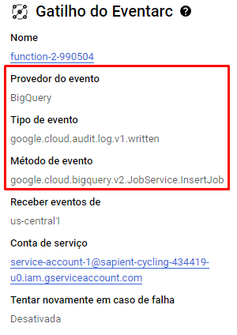

# Limite de retrocesso de tempo de particionamento por consulta

Uma das maneiras de limitar o usuário de realizar determinadas queries é criando uma função UDF (User Defined Function) no BigQuery, vou mostrar como fiz:

*1º passo: Encontrar a tabela particionada no BigQuery e criar uma consulta em nova guia*


*2º passo: Executar o seguinte script para criar uma função de validação*

[Execute este script](/Sprints/SP02-1410/Julio/Script/UDF.sql)

Será criado uma função, dentro de Rotinas que não permite ao usuário executar uma query que englobe um período maior que 2 meses

---------------------------------------------------------------------------------------------------

*Testando na prática*


Nesse caso retorna erro pois o intervalo de tempo é maior que 2 meses


Nesse caso a consulta é realizada com sucesso pois o intervalo é menor ou igual a 2 meses

---------------------------------------------------------------------------------------------------


Outra maneira de limitar o usuário de realizar queries é criando uma VIEW direto no DataForm do BigQuery.

**1º passo**: Entrar no BigQuery e selecionar o DataForm para criar a view, clicar em novo arquivo, colocar o nome que desejar e criar o arquivo


**2º passo**: configure sua view com o Tipo, Schema e Descrição. Após isso, colocar o código da consulta. 


```
-- Início da consulta que será utilizada pela view
SELECT *  -- Seleciona todas as colunas da tabela
FROM sapient-cycling-434419-u0.Purchases.teste_Purchases -- Define a tabela específica de onde os dados serão extraídos

-- Filtra as compras realizadas dentro de um intervalo de 60 dias
WHERE TIMESTAMP_TRUNC(purchase_datetime, DAY)  -- Trunca a data de compra para considerar apenas a parte do dia (ignorando horas e minutos)
  BETWEEN TIMESTAMP_SUB(TIMESTAMP("2023-10-13"),  -- Define o final do intervalo como 13 de outubro de 2023
  INTERVAL 60 DAY)  -- Subtrai 60 dias a partir de 13 de outubro de 2023 para definir o início do intervalo
  AND TIMESTAMP("2023-10-13")  -- Define o final do intervalo como exatamente o dia 13 de outubro de 2023

```

A partir desse código, será criado a view da minha tabela particionada com a limitação de apenas 2 meses.

---------------------------------------------------------------------------------------------------

*Execute o seguinte script para testar a validação*

[Execute esse script para teste](leticia/script/query.sql)

Com o script acima trará o seguinte resultado:


Com isso, podemos ver que a query foi bem sucedida trazendo os dados desde o dia 13/10 até o dia 14/08 (total de 02 meses).

---------------------------------------------------------------------------------------------------

**Comparação de bytes processados e faturados entre uma tabela e uma view particionada com o limite**

*Na tabela:*


---------------------------------------------------------------------------------------------------

*Na view:*


# Clusterização
Culsterizar uma tabela siginifica **ordenar uma tabela de acordo com determinadas colunas**. Até 4 colunas podem ser denominadas para a clusterização.


## Exemplo de otimização de custos com clustering
Realizamos - com o fito de exemplificar - a mesma consulta na mesma tabela de 36GB de dados quando está não-clusterizada e quando está clusterizada:

### Consulta na tabela não-clusterizada:


A consulta custou 4,68GB de dados e consumiu a média de 53,549 slots

### Consulta na tabela clusterizada


A consulta custou, dessa vez, apenas 10MB que, quando em comparação com a outra consulta, apresentou 468x menos custos

    4,68GB / 0,01GB = 468

A consulta utilizou em média 1,028 slots, apresentando uma redução de 52X quando em comparação com a consulta anterior

    53,549 / 1,028 = 52,09

O custo pode ser ainda mais reduzido combinando clusterização com o particionamento de tabelas:

```
CREATE TABLE partition_cluster
PARTITION BY TIMESTAMP(campo_data)
CLUSTER BY campo1_campo2
AS SELECT * FROM tabela
```

# Forçando o particionamento e clusterização na criação de tabelas
Não existe um jeito direto de impedir a obrigatoriedade de particionamento e clustering em uma tabela no BQ, porém há uma forma de fazer via Clud Functions:

Na criação de uma função Cloud Run, determina-se que os logs de criação de tabelas / inserção de dados em tabelas serão automaticamente enviados para que a função seja executada:



Os logs são, portanto, enviados ao cloud-run, onde um script python é executado, recebendo o payload do log e determinando se a tabela criada é particionada ou não. Caso não haja particionamento e clustering, deleta a tabela e envia um erro no log: 

