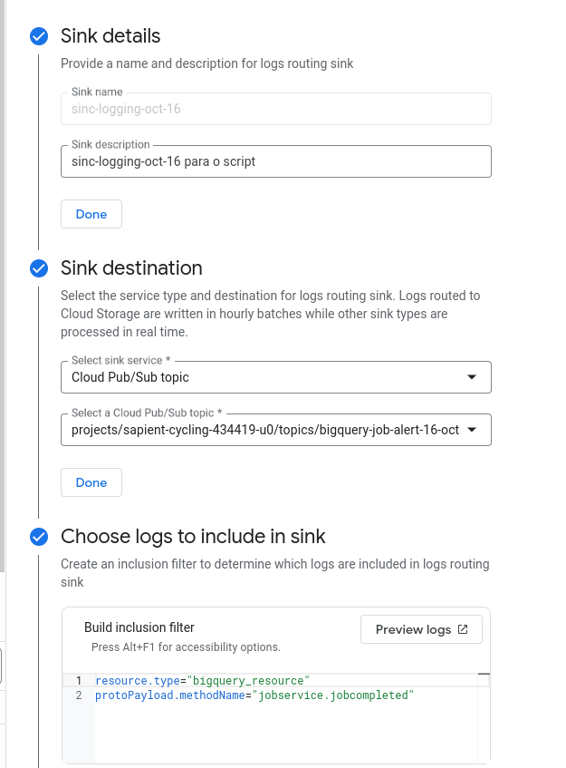

# Sistema de Alerta BigQuery para Pub/Sub

Este projeto é um sistema de alerta baseado no Google Cloud, projetado para monitorar trabalhos do BigQuery e acionar alertas se determinadas condições forem atendidas, como o processamento de dados que excede um limite específico. A configuração utiliza Google Cloud Pub/Sub, Cloud Functions e Gmail para notificações por e-mail.

## Visão Geral
A solução envolve os seguintes componentes:

1. **Logs do BigQuery**: Logs do BigQuery são monitorados para eventos específicos (por exemplo, conclusão de trabalho).
2. **Sink de Cloud Logging**: Um sink foi criado para exportar logs para um tópico do Pub/Sub quando determinadas condições são atendidas (por exemplo, eventos de serviço de trabalho).
3. **Tópico Pub/Sub**: Os logs são enviados para um tópico específico do Pub/Sub que serve como canal de mensagens.
4. **Cloud Function**: Uma Cloud Function processa as mensagens do Pub/Sub, as decodifica, verifica condições (por exemplo, bytes processados) e envia um e-mail de alerta via Gmail usando Nodemailer.


## Componentes

### 1. Sink de Cloud Logging
- Um **sink** chamado `sinc-logging-oct-16` foi criado para filtrar os logs de trabalho do BigQuery e enviá-los para um tópico do Pub/Sub.
- **Critérios de Filtro**: O filtro garante que apenas os logs relacionados à conclusão de trabalhos no BigQuery sejam encaminhados.
- **Destino**: Os logs são enviados para o tópico do Pub/Sub `bigquery-job-alert-16-oct`.



### 2. Tópico Pub/Sub
- O **tópico Pub/Sub** `bigquery-job-alert-16-oct` atua como intermediário, recebendo mensagens do sink e entregando-as para a Cloud Function.
- **Assinatura**: Uma assinatura chamada `bigquery-job-alert-16-oct-sub` é usada para que a Cloud Function puxe mensagens do tópico.
- **Métricas**: Há gráficos disponíveis para monitorar o número de mensagens não reconhecidas e a idade das mensagens.


### 3. Cloud Function
- A **Cloud Function** chamada `BigQueryHandlerAlert` é implantada com a seguinte funcionalidade:
  - **Tratamento de Entrada**: Decodifica o payload da mensagem do Pub/Sub e verifica a consistência dos dados.
  - **Verificação de Condições**: Verifica se o total de bytes processados de um trabalho do BigQuery excede um limite especificado (por exemplo, 1TB).
  - **Alertas por E-mail**: Usa Nodemailer para enviar notificações por e-mail quando as condições são acionadas. O Gmail é usado como serviço de e-mail, exigindo uma senha de aplicativo.


### 4. Configuração do Nodemailer
- **Serviço**: A Cloud Function está configurada para usar o Gmail como serviço de e-mail.
- **Credenciais**: Requer uma conta do Gmail e uma senha de aplicativo para autenticação.
- **Acionamento de Alerta**: O e-mail de alerta contém detalhes do trabalho do BigQuery, incluindo o número de bytes processados.

## Exemplo de Código (Cloud Function)
```javascript
const nodemailer = require('nodemailer');

exports.bigQueryAlertHandler = (message, context) => {
    // Configuração do serviço de e-mail (Gmail, por exemplo)
    let transporter = nodemailer.createTransport({
        service: 'gmail',
        auth: {
            user: 'vincenzo.amendola142804@gmail.com',
            pass: 'APP_SPECIFIC_PASSWORD' // Certifique-se de usar uma senha de aplicativo do Gmail
        }
    });

    // Decodificando os dados da mensagem
    let alertData;
    try {
        alertData = JSON.parse(Buffer.from(message.data, 'base64').toString());
    } catch (error) {
        console.error('Erro ao decodificar a mensagem:', error);
        return;
    }

    // Verifica se o JSON possui as informações necessárias
    if (alertData && alertData.protoPayload && alertData.protoPayload.serviceData.jobCompletedEvent) {
        const jobStats = alertData.protoPayload.serviceData.jobCompletedEvent.job.jobStatistics;
        const totalProcessedBytes = parseInt(jobStats.totalProcessedBytes, 10);
        const limitBytes = 1000000000000; // 1 TB como limite de teste

        if (totalProcessedBytes > limitBytes) {
            console.log(`Alerta: Query excedeu o limite de bytes (${totalProcessedBytes} bytes)`);
            
            // Enviar o e-mail
            let mailOptions = {
                from: 'vincenzo.amendola142804@gmail.com',
                to: alertData.protoPayload.authenticationInfo.principalEmail,
                subject: 'Alerta: Limite de Bytes Excedido',
                text: `A query executada excedeu o limite de bytes permitido. Total processado: ${totalProcessedBytes} bytes.`
            };

            transporter.sendMail(mailOptions, (error, info) => {
                if (error) {
                    console.error('Erro ao enviar o e-mail:', error);
                } else {
                    console.log('E-mail enviado:', info.response);
                }
            });
        }
    }
};
```


## Observações
- Os logs indicam que há mensagens com erros de "JSON inválido", sugerindo problemas no formato da mensagem ou estruturas de dados inesperadas no payload do Pub/Sub.
- Vários alertas por e-mail foram enviados com sucesso, mas algumas tentativas parecem encontrar problemas ao enviar.
- É importante garantir que as permissões do Pub/Sub estejam configuradas corretamente para que a Cloud Function possa ler as mensagens recebidas.


## Configuração de Permissões e IAM
- **Permissões da Conta de Serviço**: Certifique-se de que a conta de serviço do Pub/Sub tenha permissão `pubsub.publisher` para encaminhar mensagens e que a conta de serviço da Cloud Function tenha permissão `pubsub.subscriber` para lê-las.
- **Ajustes no IAM**: A função pode precisar de ajustes no IAM para resolver problemas de permissão relacionados à integração.
