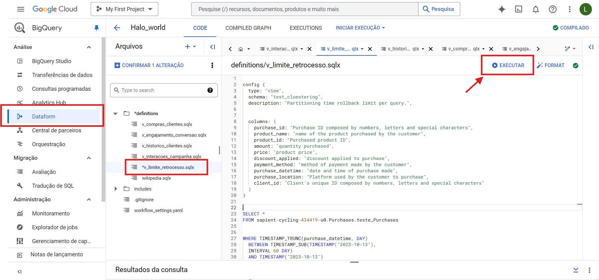

**Limite de retrocesso de tempo de particionamento por consulta**

Uma das maneiras de limitar o usuário de realizar queries é criando uma VIEW direto no DataForm do BigQuery.

**1º passo**: Entrar no BigQuery e selecionar o DataForm para criar a view, clicar em novo arquivo, colocar o nome que desejar e criar o arquivo


**2º passo**: configure sua view com o Tipo, Schema e Descrição. Após isso, colocar o código da consulta. 



```
-- Início da consulta que será utilizada pela view

SELECT *  -- Seleciona todas as colunas da tabela
FROM `sapient-cycling-434419-u0.test_cluestering.clustering_month_test`  -- Define a tabela específica de onde os dados serão extraídos

-- Filtra as compras realizadas dentro de um intervalo de 60 dias (02 meses)
WHERE TIMESTAMP_TRUNC(purchase_datetime, DAY)  -- Trunca a data de compra para considerar apenas a parte do dia (ignorando horas e minutos)
  BETWEEN TIMESTAMP_SUB(TIMESTAMP("2023-10-13"),  -- Define o final do intervalo como 13 de outubro de 2023 
  INTERVAL 60 DAY)  -- Subtrai 60 dias a partir de 13 de outubro de 2023 para definir o início do intervalo
  AND TIMESTAMP("2023-10-13")  -- Define o final do intervalo como exatamente o dia 13 de outubro de 2023

```

A partir desse código, será criado a view da minha tabela particionada com a limitação de apenas 2 meses.

---------------------------------------------------------------------------------------------------

*Execute o seguinte script para testar a validação*

[Execute esse script para teste](script/query.sql)

Com o script acima trará o seguinte resultado:


Com isso, podemos ver que a query foi bem sucedida trazendo os dados desde o dia 13/10 até o dia 14/08 (total de 02 meses).


---------------------------------------------------------------------------------------------------