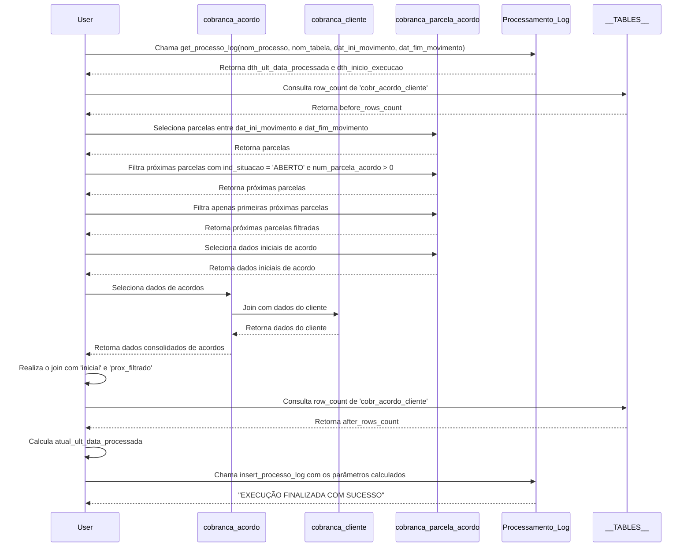

```mermaid
sequenceDiagram
    participant User
    participant cobranca_acordo
    participant cobranca_cliente
    participant cobranca_parcela_acordo
    participant Processamento_Log
    participant __TABLES__

    User->>Processamento_Log: Chama get_processo_log(nom_processo, nom_tabela, dat_ini_movimento, dat_fim_movimento)
    Processamento_Log-->>User: Retorna dth_ult_data_processada e dth_inicio_execucao

    User->>__TABLES__: Consulta row_count de 'cobr_acordo_cliente'
    __TABLES__-->>User: Retorna before_rows_count

    User->>cobranca_parcela_acordo: Seleciona parcelas entre dat_ini_movimento e dat_fim_movimento
    cobranca_parcela_acordo-->>User: Retorna parcelas

    User->>cobranca_parcela_acordo: Filtra próximas parcelas com ind_situacao = 'ABERTO' e num_parcela_acordo > 0
    cobranca_parcela_acordo-->>User: Retorna próximas parcelas

    User->>cobranca_parcela_acordo: Filtra apenas primeiras próximas parcelas
    cobranca_parcela_acordo-->>User: Retorna próximas parcelas filtradas

    User->>cobranca_parcela_acordo: Seleciona dados iniciais de acordo
    cobranca_parcela_acordo-->>User: Retorna dados iniciais de acordo

    User->>cobranca_acordo: Seleciona dados de acordos
    cobranca_acordo->>cobranca_cliente: Join com dados do cliente
    cobranca_cliente-->>cobranca_acordo: Retorna dados do cliente
    cobranca_acordo-->>User: Retorna dados consolidados de acordos

    User->>User: Realiza o join com 'inicial' e 'prox_filtrado'

    User->>__TABLES__: Consulta row_count de 'cobr_acordo_cliente'
    __TABLES__-->>User: Retorna after_rows_count

    User->>User: Calcula atual_ult_data_processada

    User->>Processamento_Log: Chama insert_processo_log com os parâmetros calculados
    Processamento_Log-->>User: "EXECUÇÃO FINALIZADA COM SUCESSO"

```