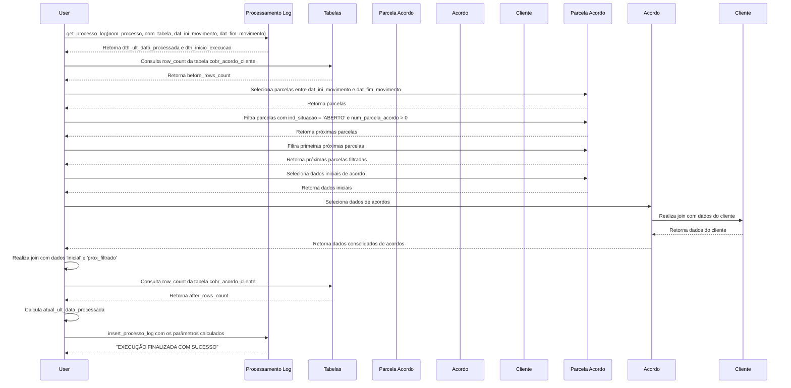

```mermaid
sequenceDiagram
    participant User
    participant Processamento_Log as Processamento Log
    participant __TABLES__ as Tabelas
    participant cobranca_parcela_acordo as Parcela Acordo
    participant cobranca_acordo as Acordo
    participant cobranca_cliente as Cliente

    %% Início do Processo e Consulta de Logs
    User->>Processamento_Log: get_processo_log(nom_processo, nom_tabela, dat_ini_movimento, dat_fim_movimento)
    Processamento_Log-->>User: Retorna dth_ult_data_processada e dth_inicio_execucao

    %% Obtenção do Row Count Inicial
    User->>__TABLES__: Consulta row_count da tabela cobr_acordo_cliente
    __TABLES__-->>User: Retorna before_rows_count

    %% Filtragem de Parcelas
    User->>Parcela Acordo: Seleciona parcelas entre dat_ini_movimento e dat_fim_movimento
    Parcela Acordo-->>User: Retorna parcelas

    User->>Parcela Acordo: Filtra parcelas com ind_situacao = 'ABERTO' e num_parcela_acordo > 0
    Parcela Acordo-->>User: Retorna próximas parcelas

    User->>Parcela Acordo: Filtra primeiras próximas parcelas
    Parcela Acordo-->>User: Retorna próximas parcelas filtradas

    User->>Parcela Acordo: Seleciona dados iniciais de acordo
    Parcela Acordo-->>User: Retorna dados iniciais

    %% Seleção e Consolidação dos Dados de Acordo
    User->>Acordo: Seleciona dados de acordos
    Acordo->>Cliente: Realiza join com dados do cliente
    Cliente-->>Acordo: Retorna dados do cliente
    Acordo-->>User: Retorna dados consolidados de acordos

    %% Join e Consolidação
    User->>User: Realiza join com dados 'inicial' e 'prox_filtrado'

    %% Obtenção do Row Count Final
    User->>__TABLES__: Consulta row_count da tabela cobr_acordo_cliente
    __TABLES__-->>User: Retorna after_rows_count

    %% Finalização e Registro de Log
    User->>User: Calcula atual_ult_data_processada
    User->>Processamento_Log: insert_processo_log com os parâmetros calculados
    Processamento_Log-->>User: "EXECUÇÃO FINALIZADA COM SUCESSO"

```