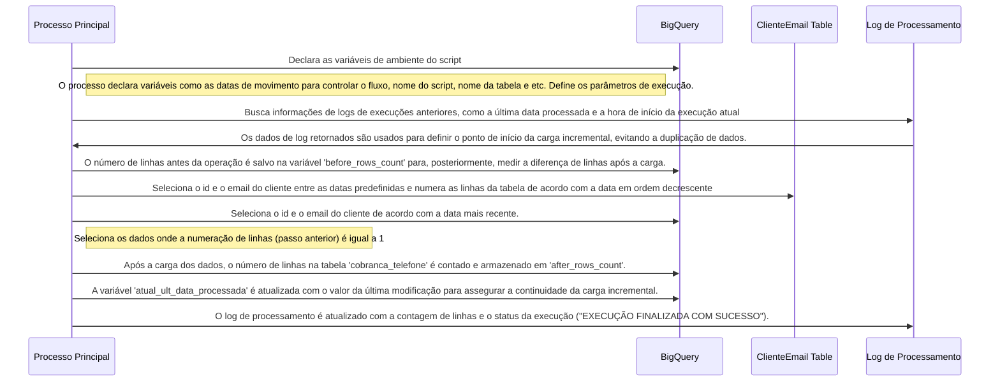

```mermaid
sequenceDiagram
    participant Processo as Processo Principal
    participant BigQuery as BigQuery
    participant ClienteEmail as ClienteEmail Table
    participant Logs as Log de Processamento

    Processo->>BigQuery: Declara as variáveis de ambiente do script
    note right of Processo: O processo declara variáveis como as datas de movimento para controlar o fluxo, nome do script, nome da tabela e etc. Define os parâmetros de execução.

    Processo->>Logs: Busca informações de logs de execuções anteriores, como a última data processada e a hora de início da execução atual
    
    Logs->>Processo: Os dados de log retornados são usados para definir o ponto de início da carga incremental, evitando a duplicação de dados.

    Processo->>BigQuery: O número de linhas antes da operação é salvo na variável 'before_rows_count' para, posteriormente, medir a diferença de linhas após a carga.

    Processo->>ClienteEmail: Seleciona o id e o email do cliente entre as datas predefinidas e numera as linhas da tabela de acordo com a data em ordem decrescente

    Processo->>BigQuery: Seleciona o id e o email do cliente de acordo com a data mais recente.
    note right of Processo: Seleciona os dados onde a numeração de linhas (passo anterior) é igual a 1

    Processo->>BigQuery: Após a carga dos dados, o número de linhas na tabela 'cobranca_telefone' é contado e armazenado em 'after_rows_count'.

    Processo->>BigQuery: A variável 'atual_ult_data_processada' é atualizada com o valor da última modificação para assegurar a continuidade da carga incremental.

    Processo->>Logs: O log de processamento é atualizado com a contagem de linhas e o status da execução ("EXECUÇÃO FINALIZADA COM SUCESSO").
```