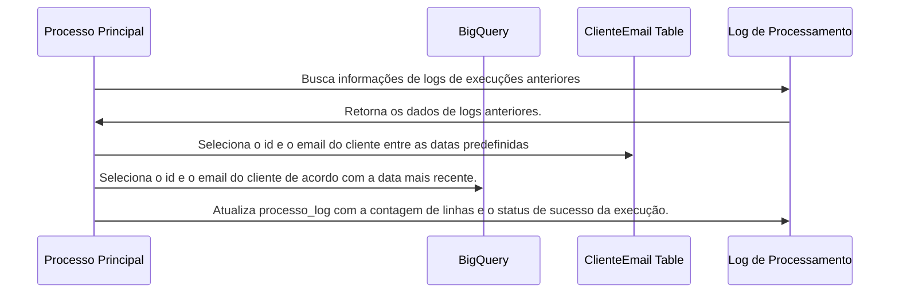

```mermaid
sequenceDiagram
    participant Processo as Processo Principal
    participant BigQuery as BigQuery
    participant ClienteEmail as ClienteEmail Table
    participant Logs as Log de Processamento

    Processo->>Logs: Busca informações de logs de execuções anteriores
    
    Logs->>Processo: Retorna os dados de logs anteriores.

    Processo->>ClienteEmail: Seleciona o id e o email do cliente entre as datas predefinidas

    Processo->>BigQuery: Seleciona o id e o email do cliente de acordo com a data mais recente.

    Processo->>Logs: Atualiza processo_log com a contagem de linhas e o status de sucesso da execução.
```