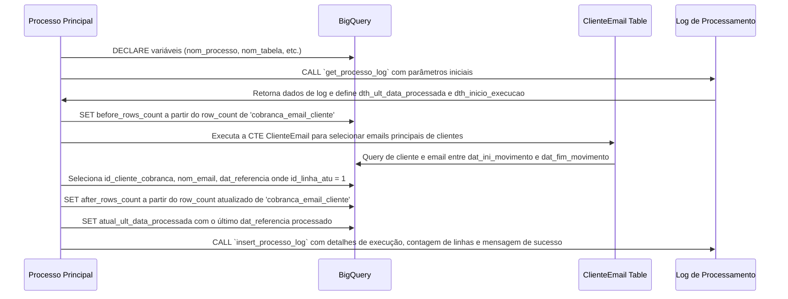

```mermaid
sequenceDiagram
    participant Processo as Processo Principal
    participant BigQuery as BigQuery
    participant ClienteEmail as ClienteEmail Table
    participant Logs as Log de Processamento

    Processo->>BigQuery: DECLARE variáveis (nom_processo, nom_tabela, etc.)
    Processo->>Logs: CALL `get_processo_log` com parâmetros iniciais
    Logs->>Processo: Retorna dados de log e define dth_ult_data_processada e dth_inicio_execucao

    Processo->>BigQuery: SET before_rows_count a partir do row_count de 'cobranca_email_cliente'

    Processo->>ClienteEmail: Executa a CTE ClienteEmail para selecionar emails principais de clientes
    ClienteEmail->>BigQuery: Query de cliente e email entre dat_ini_movimento e dat_fim_movimento

    Processo->>BigQuery: Seleciona id_cliente_cobranca, nom_email, dat_referencia onde id_linha_atu = 1

    Processo->>BigQuery: SET after_rows_count a partir do row_count atualizado de 'cobranca_email_cliente'
    Processo->>BigQuery: SET atual_ult_data_processada com o último dat_referencia processado

    Processo->>Logs: CALL `insert_processo_log` com detalhes de execução, contagem de linhas e mensagem de sucesso
```