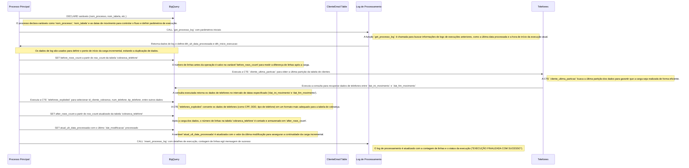

```mermaid
sequenceDiagram
    participant Processo as Processo Principal
    participant BigQuery as BigQuery
    participant ClienteEmail as ClienteEmail Table
    participant Logs as Log de Processamento

    Processo->>BigQuery: DECLARE variáveis (nom_processo, nom_tabela, etc.)
    note right of Processo: O processo declara variáveis como 'nom_processo', 'nom_tabela' e as datas de movimento para controlar o fluxo e definir parâmetros de execução.

    Processo->>Logs: CALL `get_processo_log` com parâmetros iniciais
    note right of Logs: A função `get_processo_log` é chamada para buscar informações de logs de execuções anteriores, como a última data processada e a hora de início da execução atual.

    Logs->>Processo: Retorna dados de log e define dth_ult_data_processada e dth_inicio_execucao
    note over Processo,BigQuery: Os dados de log são usados para definir o ponto de início da carga incremental, evitando a duplicação de dados.

    Processo->>BigQuery: SET before_rows_count a partir do row_count da tabela 'cobranca_telefone'
    note right of BigQuery: O número de linhas antes da operação é salvo na variável 'before_rows_count' para medir a diferença de linhas após a carga.

    Processo->>Telefones: Executa a CTE `cliente_ultima_particao` para obter a última partição da tabela de clientes
    note right of Telefones: A CTE `cliente_ultima_particao` busca a última partição dos dados para garantir que a carga seja realizada de forma eficiente.

    Telefones->>BigQuery: Executa a consulta para recuperar dados de telefones entre `dat_ini_movimento` e `dat_fim_movimento`
    note right of BigQuery: A consulta executada retorna os dados de telefones no intervalo de datas especificado ('dat_ini_movimento' e 'dat_fim_movimento').

    Processo->>BigQuery: Executa a CTE `telefones_exploded` para selecionar id_cliente_cobranca, num_telefone, tip_telefone, entre outros dados
    note right of BigQuery: A CTE `telefones_exploded` converte os dados de telefones (como CPF, DDD, tipo de telefone) em um formato mais adequado para a tabela de cobrança.

    Processo->>BigQuery: SET after_rows_count a partir do row_count atualizado da tabela 'cobranca_telefone'
    note right of BigQuery: Após a carga dos dados, o número de linhas na tabela 'cobranca_telefone' é contado e armazenado em 'after_rows_count'.

    Processo->>BigQuery: SET atual_ult_data_processada com o último `dat_modificacao` processado
    note right of BigQuery: A variável 'atual_ult_data_processada' é atualizada com o valor da última modificação para assegurar a continuidade da carga incremental.

    Processo->>Logs: CALL `insert_processo_log` com detalhes de execução, contagem de linhas egit mensagem de sucesso
    note right of Logs: O log de processamento é atualizado com a contagem de linhas e o status da execução ("EXECUÇÃO FINALIZADA COM SUCESSO").


```