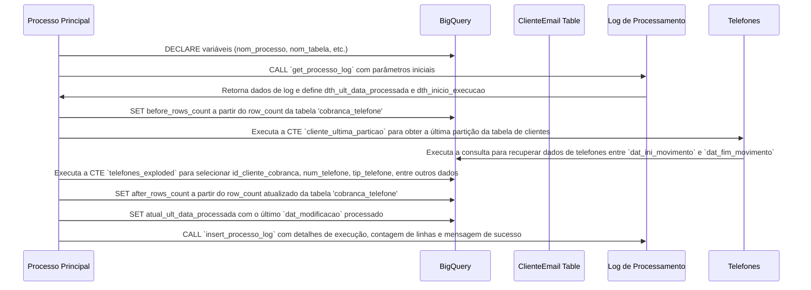

```mermaid
sequenceDiagram
    participant Processo as Processo Principal
    participant BigQuery as BigQuery
    participant ClienteEmail as ClienteEmail Table
    participant Logs as Log de Processamento

    Processo->>BigQuery: DECLARE variáveis (nom_processo, nom_tabela, etc.)
    Processo->>Logs: CALL `get_processo_log` com parâmetros iniciais
    Logs->>Processo: Retorna dados de log e define dth_ult_data_processada e dth_inicio_execucao
    Processo->>BigQuery: SET before_rows_count a partir do row_count da tabela 'cobranca_telefone'

    Processo->>Telefones: Executa a CTE `cliente_ultima_particao` para obter a última partição da tabela de clientes
    Telefones->>BigQuery: Executa a consulta para recuperar dados de telefones entre `dat_ini_movimento` e `dat_fim_movimento`
    Processo->>BigQuery: Executa a CTE `telefones_exploded` para selecionar id_cliente_cobranca, num_telefone, tip_telefone, entre outros dados

    Processo->>BigQuery: SET after_rows_count a partir do row_count atualizado da tabela 'cobranca_telefone'
    Processo->>BigQuery: SET atual_ult_data_processada com o último `dat_modificacao` processado
    Processo->>Logs: CALL `insert_processo_log` com detalhes de execução, contagem de linhas e mensagem de sucesso

```