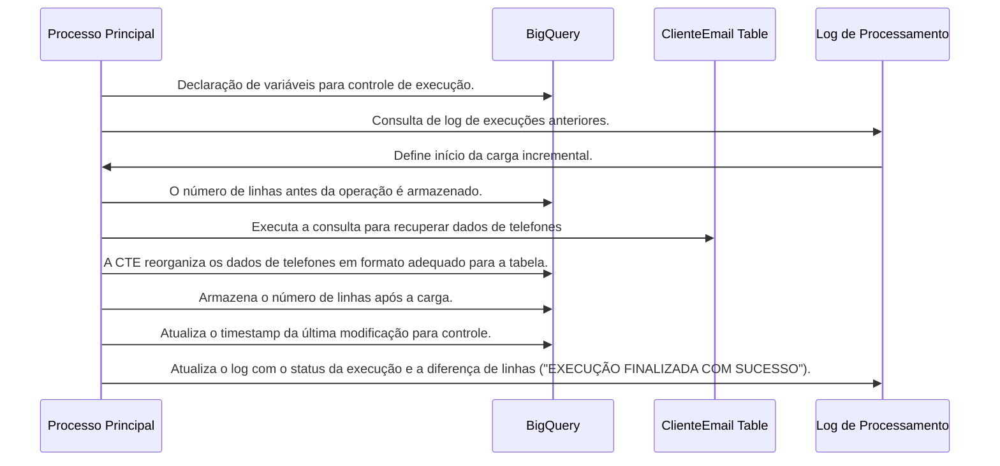

```mermaid
sequenceDiagram
    participant Processo as Processo Principal
    participant BigQuery as BigQuery
    participant ClienteEmail as ClienteEmail Table
    participant Logs as Log de Processamento

    Processo->>BigQuery: Declaração de variáveis para controle de execução.

    Processo->>Logs: Consulta de log de execuções anteriores.

    Logs->>Processo: Define início da carga incremental.

    Processo->>BigQuery: O número de linhas antes da operação é armazenado.

    Processo->>ClienteEmail: Executa a consulta para recuperar dados de telefones 

    Processo->>BigQuery: A CTE reorganiza os dados de telefones em formato adequado para a tabela.

    Processo->>BigQuery: Armazena o número de linhas após a carga.

    Processo->>BigQuery: Atualiza o timestamp da última modificação para controle.

    Processo->>Logs: Atualiza o log com o status da execução e a diferença de linhas ("EXECUÇÃO FINALIZADA COM SUCESSO").


```