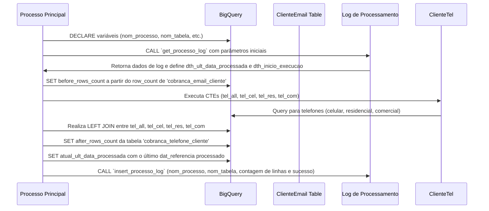

```mermaid
sequenceDiagram
    participant Processo as Processo Principal
    participant BigQuery as BigQuery
    participant ClienteEmail as ClienteEmail Table
    participant Logs as Log de Processamento

    Processo->>BigQuery: DECLARE variáveis (nom_processo, nom_tabela, etc.)
    Processo->>Logs: CALL `get_processo_log` com parâmetros iniciais
    Logs->>Processo: Retorna dados de log e define dth_ult_data_processada e dth_inicio_execucao
    Processo->>BigQuery: SET before_rows_count a partir do row_count de 'cobranca_email_cliente'

    Processo->>ClienteTel: Executa CTEs (tel_all, tel_cel, tel_res, tel_com)
    ClienteTel->>BigQuery: Query para telefones (celular, residencial, comercial)
    Processo->>BigQuery: Realiza LEFT JOIN entre tel_all, tel_cel, tel_res, tel_com

    Processo->>BigQuery: SET after_rows_count da tabela 'cobranca_telefone_cliente'
    Processo->>BigQuery: SET atual_ult_data_processada com o último dat_referencia processado
    Processo->>Logs: CALL `insert_processo_log` (nom_processo, nom_tabela, contagem de linhas e sucesso)


```