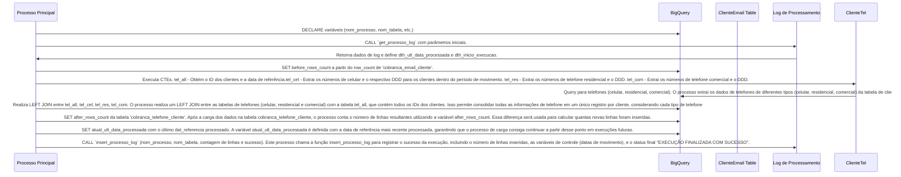

```mermaid
sequenceDiagram
    participant Processo as Processo Principal
    participant BigQuery as BigQuery
    participant ClienteEmail as ClienteEmail Table
    participant Logs as Log de Processamento

    %% Essas variáveis serão utilizadas ao longo do fluxo para controle e execução do procedimento
    Processo->>BigQuery: DECLARE variáveis (nom_processo, nom_tabela, etc.) 
    %% O processo principal chama a função get_processo_log, que recupera os registros de processamento anteriores, incluindo a última data processada (dth_ult_data_processada) e a hora de início da execução (dth_inicio_execucao). Essas informações são essenciais para controlar a execução incremental e assegurar que dados duplicados ou desatualizados não sejam carregados
    Processo->>Logs: CALL `get_processo_log` com parâmetros iniciais. 
    %% O processo consulta o BigQuery para contar quantas linhas já existem na tabela cobranca_telefone_cliente antes de iniciar as operações de carga. 
    Logs->>Processo: Retorna dados de log e define dth_ult_data_processada e dth_inicio_execucao.
    %% Isso é feito utilizando a variável before_rows_count, que servirá para medir a diferença ao final do processo.
    Processo->>BigQuery: SET before_rows_count a partir do row_count de 'cobranca_email_cliente'.

    Processo->>ClienteTel: Executa CTEs. tel_all - Obtém o ID dos clientes e a data de referência.tel_cel - Extrai os números de celular e o respectivo DDD para os clientes dentro do período de movimento. tel_res - Extrai os números de telefone residencial e o DDD. tel_com - Extrai os números de telefone comercial e o DDD.
    ClienteTel->>BigQuery: Query para telefones (celular, residencial, comercial). O processo extrai os dados de telefones de diferentes tipos (celular, residencial, comercial) da tabela de clientes, executando consultas no BigQuery
    Processo->>BigQuery: Realiza LEFT JOIN entre tel_all, tel_cel, tel_res, tel_com. O processo realiza um LEFT JOIN entre as tabelas de telefones (celular, residencial e comercial) com a tabela tel_all, que contém todos os IDs dos clientes. Isso permite consolidar todas as informações de telefone em um único registro por cliente, considerando cada tipo de telefone

    Processo->>BigQuery: SET after_rows_count da tabela 'cobranca_telefone_cliente'.  Após a carga dos dados na tabela cobranca_telefone_cliente, o processo conta o número de linhas resultantes utilizando a variável after_rows_count. Essa diferença será usada para calcular quantas novas linhas foram inseridas.
    Processo->>BigQuery: SET atual_ult_data_processada com o último dat_referencia processado.  A variável atual_ult_data_processada é definida com a data de referência mais recente processada, garantindo que o processo de carga consiga continuar a partir desse ponto em execuções futuras.
    Processo->>Logs: CALL `insert_processo_log` (nom_processo, nom_tabela, contagem de linhas e sucesso).  Este processo chama a função insert_processo_log para registrar o sucesso da execução, incluindo o número de linhas inseridas, as variáveis de controle (datas de movimento), e o status final "EXECUÇÃO FINALIZADA COM SUCESSO".


```