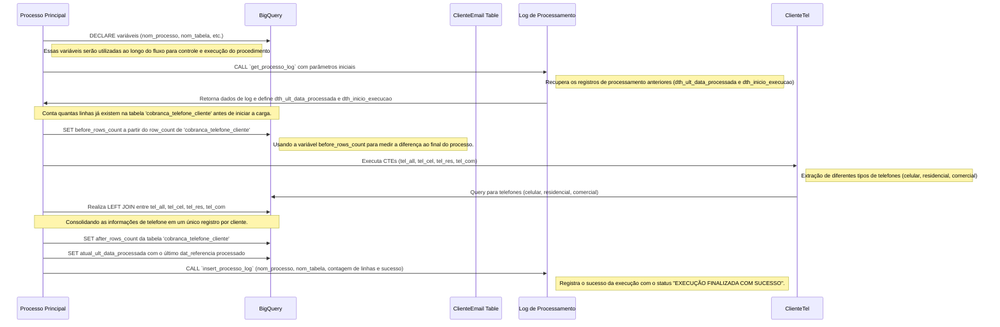

```mermaid
sequenceDiagram
    participant Processo as Processo Principal
    participant BigQuery as BigQuery
    participant ClienteEmail as ClienteEmail Table
    participant Logs as Log de Processamento

    Processo->>BigQuery: DECLARE variáveis (nom_processo, nom_tabela, etc.)
    note right of Processo: Essas variáveis serão utilizadas ao longo do fluxo para controle e execução do procedimento
    
    Processo->>Logs: CALL `get_processo_log` com parâmetros iniciais
    note right of Logs: Recupera os registros de processamento anteriores (dth_ult_data_processada e dth_inicio_execucao)
    
    Logs->>Processo: Retorna dados de log e define dth_ult_data_processada e dth_inicio_execucao
    note over Processo,BigQuery: Conta quantas linhas já existem na tabela 'cobranca_telefone_cliente' antes de iniciar a carga.
    
    Processo->>BigQuery: SET before_rows_count a partir do row_count de 'cobranca_telefone_cliente'
    note right of BigQuery: Usando a variável before_rows_count para medir a diferença ao final do processo.
    
    Processo->>ClienteTel: Executa CTEs (tel_all, tel_cel, tel_res, tel_com)
    note right of ClienteTel: Extração de diferentes tipos de telefones (celular, residencial, comercial)
    
    ClienteTel->>BigQuery: Query para telefones (celular, residencial, comercial)
    
    Processo->>BigQuery: Realiza LEFT JOIN entre tel_all, tel_cel, tel_res, tel_com
    note over Processo,BigQuery: Consolidando as informações de telefone em um único registro por cliente.
    
    Processo->>BigQuery: SET after_rows_count da tabela 'cobranca_telefone_cliente'
    
    Processo->>BigQuery: SET atual_ult_data_processada com o último dat_referencia processado
    
    Processo->>Logs: CALL `insert_processo_log` (nom_processo, nom_tabela, contagem de linhas e sucesso)
    note right of Logs: Registra o sucesso da execução com o status "EXECUÇÃO FINALIZADA COM SUCESSO".


```