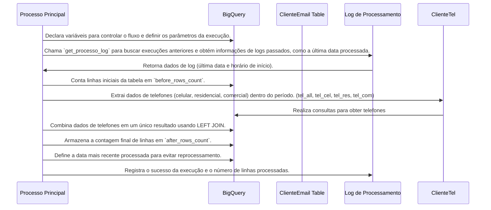

```mermaid
sequenceDiagram
    participant Processo as Processo Principal
    participant BigQuery as BigQuery
    participant ClienteEmail as ClienteEmail Table
    participant Logs as Log de Processamento

    Processo->>BigQuery: Declara variáveis para controlar o fluxo e definir os parâmetros da execução.

    Processo->>Logs: Chama `get_processo_log` para buscar execuções anteriores e obtém informações de logs passados, como a última data processada.

    Logs->>Processo: Retorna dados de log (última data e horário de início).

    Processo->>BigQuery: Conta linhas iniciais da tabela em `before_rows_count`.

    Processo->>ClienteTel: Extrai dados de telefones (celular, residencial, comercial) dentro do período. (tel_all, tel_cel, tel_res, tel_com)

    ClienteTel->>BigQuery: Realiza consultas para obter telefones

    Processo->>BigQuery: Combina dados de telefones em um único resultado usando LEFT JOIN.

    Processo->>BigQuery: Armazena a contagem final de linhas em `after_rows_count`.

    Processo->>BigQuery: Define a data mais recente processada para evitar reprocessamento.

    Processo->>Logs: Registra o sucesso da execução e o número de linhas processadas.


```