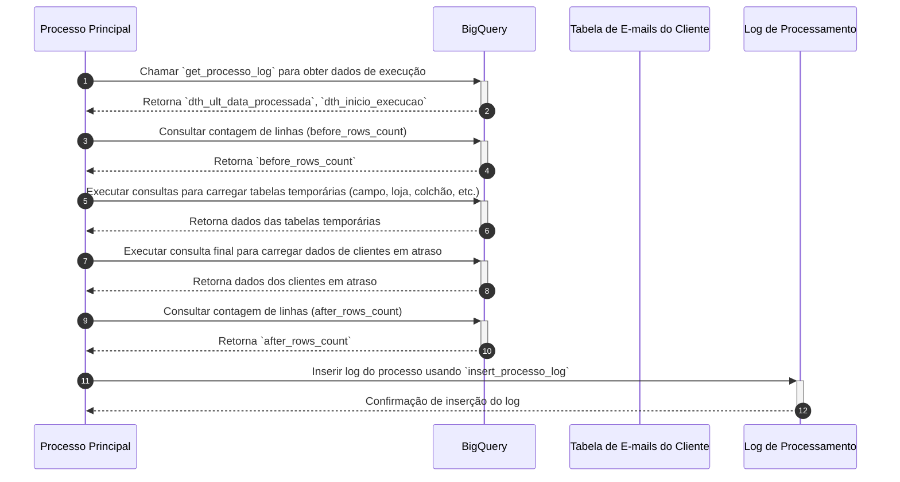

```mermaid
sequenceDiagram
    autonumber
    participant Processo as Processo Principal
    participant BigQuery as BigQuery
    participant ClienteEmail as Tabela de E-mails do Cliente
    participant Logs as Log de Processamento

    Processo->>+BigQuery: Chamar `get_processo_log` para obter dados de execução
    BigQuery-->>-Processo: Retorna `dth_ult_data_processada`, `dth_inicio_execucao`
    
    Processo->>+BigQuery: Consultar contagem de linhas (before_rows_count)
    BigQuery-->>-Processo: Retorna `before_rows_count`

    Processo->>+BigQuery: Executar consultas para carregar tabelas temporárias (campo, loja, colchão, etc.)
    BigQuery-->>-Processo: Retorna dados das tabelas temporárias
    
    Processo->>+BigQuery: Executar consulta final para carregar dados de clientes em atraso
    BigQuery-->>-Processo: Retorna dados dos clientes em atraso
    
    Processo->>+BigQuery: Consultar contagem de linhas (after_rows_count)
    BigQuery-->>-Processo: Retorna `after_rows_count`
    
    Processo->>+Logs: Inserir log do processo usando `insert_processo_log`
    Logs-->>-Processo: Confirmação de inserção do log

```