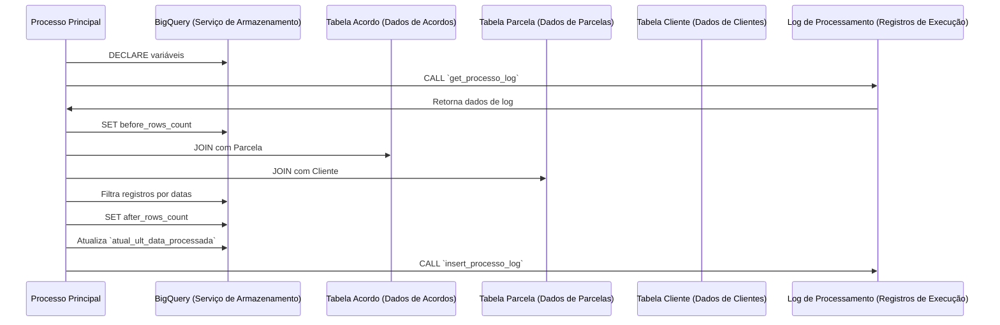

```mermaid
sequenceDiagram
    participant Processo as Processo Principal
    participant BigQuery as BigQuery (Serviço de Armazenamento)
    participant Acordo as Tabela Acordo (Dados de Acordos)
    participant Parcela as Tabela Parcela (Dados de Parcelas)
    participant Cliente as Tabela Cliente (Dados de Clientes)
    participant Logs as Log de Processamento (Registros de Execução)

    Processo->>BigQuery: DECLARE variáveis
    Processo->>Logs: CALL `get_processo_log`
    Logs->>Processo: Retorna dados de log
    Processo->>BigQuery: SET before_rows_count
    Processo->>Acordo: JOIN com Parcela
    Processo->>Parcela: JOIN com Cliente
    Processo->>BigQuery: Filtra registros por datas
    Processo->>BigQuery: SET after_rows_count
    Processo->>BigQuery: Atualiza `atual_ult_data_processada`
    Processo->>Logs: CALL `insert_processo_log`


```