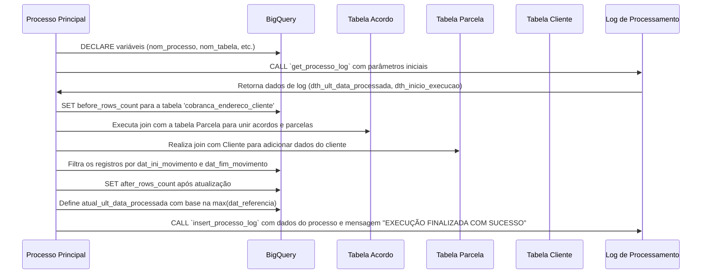

```mermaid
sequenceDiagram
    participant Processo as Processo Principal
    participant BigQuery as BigQuery
    participant Acordo as Tabela Acordo
    participant Parcela as Tabela Parcela
    participant Cliente as Tabela Cliente
    participant Logs as Log de Processamento

    Processo->>BigQuery: DECLARE variáveis (nom_processo, nom_tabela, etc.)
    Processo->>Logs: CALL `get_processo_log` com parâmetros iniciais
    Logs->>Processo: Retorna dados de log (dth_ult_data_processada, dth_inicio_execucao)

    Processo->>BigQuery: SET before_rows_count para a tabela 'cobranca_endereco_cliente'

    Processo->>Acordo: Executa join com a tabela Parcela para unir acordos e parcelas
    Processo->>Parcela: Realiza join com Cliente para adicionar dados do cliente

    Processo->>BigQuery: Filtra os registros por dat_ini_movimento e dat_fim_movimento

    Processo->>BigQuery: SET after_rows_count após atualização
    Processo->>BigQuery: Define atual_ult_data_processada com base na max(dat_referencia)
    Processo->>Logs: CALL `insert_processo_log` com dados do processo e mensagem "EXECUÇÃO FINALIZADA COM SUCESSO"

```