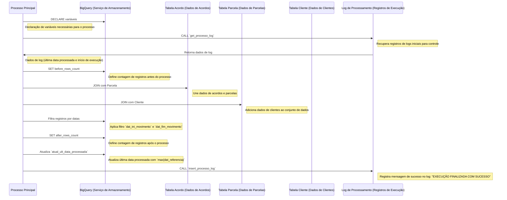

```mermaid
sequenceDiagram
    participant Processo as Processo Principal
    participant BigQuery as BigQuery (Serviço de Armazenamento)
    participant Acordo as Tabela Acordo (Dados de Acordos)
    participant Parcela as Tabela Parcela (Dados de Parcelas)
    participant Cliente as Tabela Cliente (Dados de Clientes)
    participant Logs as Log de Processamento (Registros de Execução)

    Processo->>BigQuery: DECLARE variáveis
    note right of Processo: Declaração de variáveis necessárias para o processo

    Processo->>Logs: CALL `get_processo_log`
    note right of Logs: Recupera registros de logs iniciais para controle

    Logs->>Processo: Retorna dados de log
    note right of Processo: Dados de log (última data processada e início de execução)

    Processo->>BigQuery: SET before_rows_count
    note right of BigQuery: Define contagem de registros antes do processo

    Processo->>Acordo: JOIN com Parcela
    note right of Acordo: Une dados de acordos e parcelas

    Processo->>Parcela: JOIN com Cliente
    note right of Parcela: Adiciona dados de clientes ao conjunto de dados

    Processo->>BigQuery: Filtra registros por datas
    note right of BigQuery: Aplica filtro `dat_ini_movimento` e `dat_fim_movimento`

    Processo->>BigQuery: SET after_rows_count
    note right of BigQuery: Define contagem de registros após o processo

    Processo->>BigQuery: Atualiza `atual_ult_data_processada`
    note right of BigQuery: Atualiza última data processada com `max(dat_referencia)`

    Processo->>Logs: CALL `insert_processo_log`
    note right of Logs: Registra mensagem de sucesso no log: "EXECUÇÃO FINALIZADA COM SUCESSO"


```