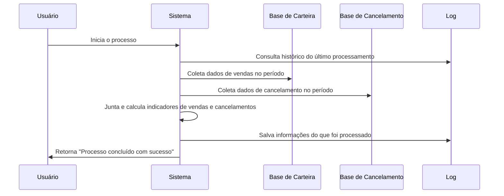

```mermaid
    sequenceDiagram
    participant Usuário
    participant Sistema
    participant Base_Carteira as Base de Carteira
    participant Base_Cancelamento as Base de Cancelamento
    participant Log

    Usuário->>Sistema: Inicia o processo
    Sistema->>Log: Consulta histórico do último processamento
    Sistema->>Base_Carteira: Coleta dados de vendas no período
    Sistema->>Base_Cancelamento: Coleta dados de cancelamento no período
    Sistema->>Sistema: Junta e calcula indicadores de vendas e cancelamentos
    Sistema->>Log: Salva informações do que foi processado
    Sistema->>Usuário: Retorna "Processo concluído com sucesso"

```