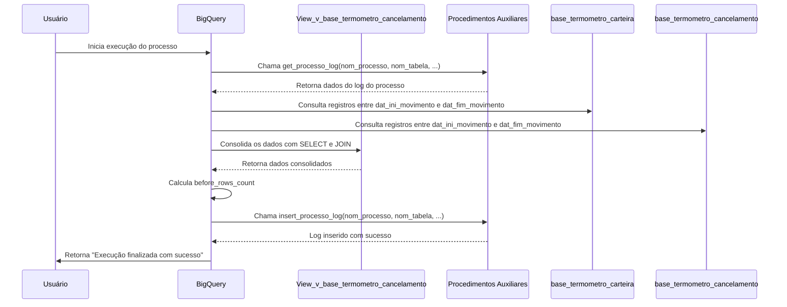

```mermaid
    sequenceDiagram
    participant Usuário
    participant BigQuery
    participant View_v_base_termometro_cancelamento
    participant Procedimentos as Procedimentos Auxiliares
    participant Tabela_Carteira as base_termometro_carteira
    participant Tabela_Cancelamento as base_termometro_cancelamento

    Usuário->>BigQuery: Inicia execução do processo
    BigQuery->>Procedimentos: Chama get_processo_log(nom_processo, nom_tabela, ...)
    Procedimentos-->>BigQuery: Retorna dados do log do processo
    
    BigQuery->>Tabela_Carteira: Consulta registros entre dat_ini_movimento e dat_fim_movimento
    BigQuery->>Tabela_Cancelamento: Consulta registros entre dat_ini_movimento e dat_fim_movimento
    
    BigQuery->>View_v_base_termometro_cancelamento: Consolida os dados com SELECT e JOIN
    View_v_base_termometro_cancelamento-->>BigQuery: Retorna dados consolidados
    
    BigQuery->>BigQuery: Calcula before_rows_count
    
    BigQuery->>Procedimentos: Chama insert_processo_log(nom_processo, nom_tabela, ...)
    Procedimentos-->>BigQuery: Log inserido com sucesso
    
    BigQuery->>Usuário: Retorna "Execução finalizada com sucesso"

```