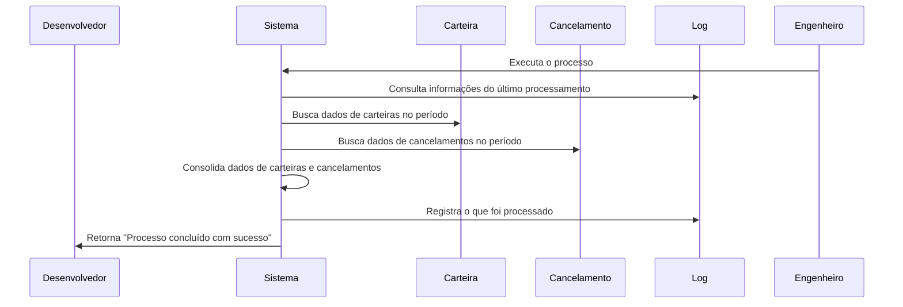

```mermaid
    sequenceDiagram
    participant Desenvolvedor
    participant Sistema
    participant Carteira
    participant Cancelamento
    participant Log

    Engenheiro->>Sistema: Executa o processo
    Sistema->>Log: Consulta informações do último processamento
    Sistema->>Carteira: Busca dados de carteiras no período
    Sistema->>Cancelamento: Busca dados de cancelamentos no período

    Sistema->>Sistema: Consolida dados de carteiras e cancelamentos
    Sistema->>Log: Registra o que foi processado

    Sistema->>Desenvolvedor: Retorna "Processo concluído com sucesso"


```