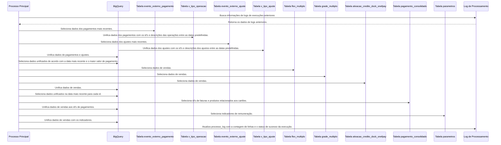

```mermaid
sequenceDiagram
    participant Processo as Processo Principal
    participant BigQuery as BigQuery
    participant Eep as Tabela evento_externo_pagamento
    participant Vtipo as Tabela v_tipo_operacao
    participant Eea as Tabela evento_externo_ajuste
    participant Vtipoajuste as Tabela v_tipo_ajuste
    participant Flex as Tabela flex_multiplo
    participant Grade as Tabela grade_multiplo
    participant Ativacao as Tabela ativacao_credito_dock_onefpay
    participant Pagamento as Tabela pagamento_consolidado
    participant Parametros as Tabela parametros
    participant Logs as Log de Processamento

    Processo->>Logs: Busca informações de logs de execuções anteriores
    
    Logs-->>Processo: Retorna os dados de logs anteriores.

    Processo->>Eep: Seleciona dados dos pagamentos mais recentes.

    BigQuery->>Vtipo: Unifica dados dos pagamentos com os id's e descrições das operações entre as datas predefinidas.

    Processo->>Eea: Seleciona dados dos ajustes mais recentes.

    BigQuery->>Vtipoajuste: Unifica dados dos ajustes com os id's e descrições dos ajustos entre as datas predefinidas.

    Processo->>BigQuery: Unifica dados de pagamentos e ajustes.

    Processo->>BigQuery: Seleciona dados unificados de acordo com a data mais recente e o maior valor de pagamento.

    Processo->>Flex: Seleciona dados de vendas.
    
    Processo->>Grade: Seleciona dados de vendas.

    Processo->>Ativacao: Seleciona dados de vendas.

    Processo->>BigQuery: Unifica dados de vendas.

    Processo->>BigQuery: Seleciona dados unificados na data mais recente para cada id.

    Processo->>Pagamento: Seleciona id's de faturas e produtos relacionados aos cartões.

    Processo->>BigQuery: Unifica dados de vendas aos id's de pagamentos.

    Processo->>Parametros: Seleciona indicadores de remuneração.

    Processo->>BigQuery: Unifica dados de vendas com os indicadores.   

    Processo->>Logs: Atualiza processo_log com a contagem de linhas e o status de sucesso da execução.
```