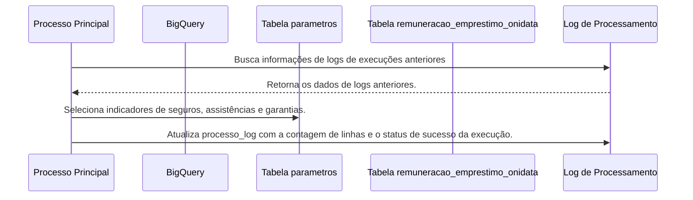

```mermaid
sequenceDiagram
    participant Processo as Processo Principal
    participant BigQuery as BigQuery
    participant Parametros as Tabela parametros
    participant Emprestimo as Tabela remuneracao_emprestimo_onidata
    participant Logs as Log de Processamento

    Processo->>Logs: Busca informações de logs de execuções anteriores
    
    Logs-->>Processo: Retorna os dados de logs anteriores.

    Processo->>Parametros: Seleciona indicadores de seguros, assistências e garantias.

    Processo->>Logs: Atualiza processo_log com a contagem de linhas e o status de sucesso da execução.
```