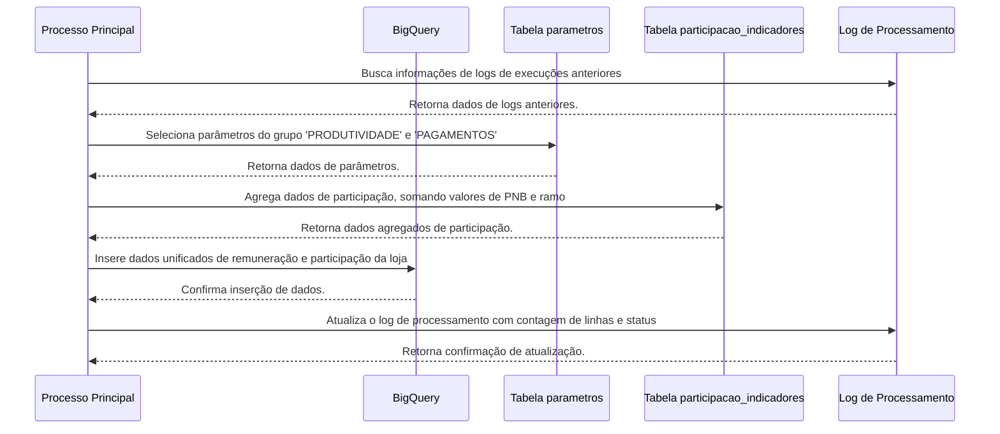

```mermaid
sequenceDiagram
    participant Processo as Processo Principal
    participant BigQuery as BigQuery
    participant Parametros as Tabela parametros
    participant Participacao as Tabela participacao_indicadores
    participant Logs as Log de Processamento

    Processo->>Logs: Busca informações de logs de execuções anteriores
    Logs-->>Processo: Retorna dados de logs anteriores.

    Processo->>Parametros: Seleciona parâmetros do grupo 'PRODUTIVIDADE' e 'PAGAMENTOS'
    Parametros-->>Processo: Retorna dados de parâmetros.

    Processo->>Participacao: Agrega dados de participação, somando valores de PNB e ramo
    Participacao-->>Processo: Retorna dados agregados de participação.

    Processo->>BigQuery: Insere dados unificados de remuneração e participação da loja
    BigQuery-->>Processo: Confirma inserção de dados.

    Processo->>Logs: Atualiza o log de processamento com contagem de linhas e status
    Logs-->>Processo: Retorna confirmação de atualização.

```