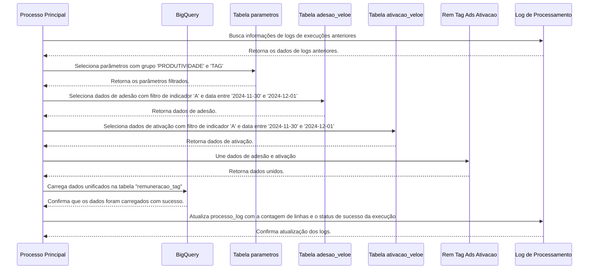

```mermaid
sequenceDiagram
    participant Processo as Processo Principal
    participant BigQuery as BigQuery
    participant Parametros as Tabela parametros
    participant Adesao as Tabela adesao_veloe
    participant Ativacao as Tabela ativacao_veloe
    participant RemTag as Rem Tag Ads Ativacao
    participant Logs as Log de Processamento

    Processo->>Logs: Busca informações de logs de execuções anteriores
    Logs-->>Processo: Retorna os dados de logs anteriores.

    Processo->>Parametros: Seleciona parâmetros com grupo 'PRODUTIVIDADE' e 'TAG'
    Parametros-->>Processo: Retorna os parâmetros filtrados.

    Processo->>Adesao: Seleciona dados de adesão com filtro de indicador 'A' e data entre '2024-11-30' e '2024-12-01'
    Adesao-->>Processo: Retorna dados de adesão.

    Processo->>Ativacao: Seleciona dados de ativação com filtro de indicador 'A' e data entre '2024-11-30' e '2024-12-01'
    Ativacao-->>Processo: Retorna dados de ativação.

    Processo->>RemTag: Une dados de adesão e ativação
    RemTag-->>Processo: Retorna dados unidos.

    Processo->>BigQuery: Carrega dados unificados na tabela "remuneracao_tag"
    BigQuery-->>Processo: Confirma que os dados foram carregados com sucesso.

    Processo->>Logs: Atualiza processo_log com a contagem de linhas e o status de sucesso da execução
    Logs-->>Processo: Confirma atualização dos logs.


```