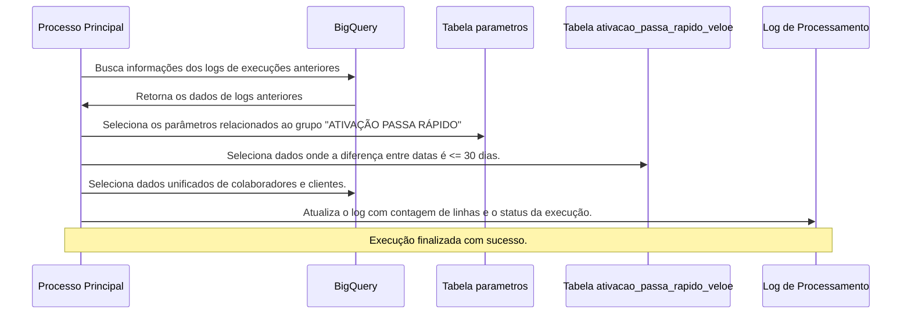

```mermaid
sequenceDiagram
    participant Processo Principal
    participant BigQuery
    participant Tabela parametros
    participant Tabela ativacao_passa_rapido_veloe
    participant Log de Processamento

    Processo Principal->>BigQuery: Busca informações dos logs de execuções anteriores
    BigQuery->>Processo Principal: Retorna os dados de logs anteriores

    Processo Principal->>Tabela parametros: Seleciona os parâmetros relacionados ao grupo "ATIVAÇÃO PASSA RÁPIDO"
    Processo Principal->>Tabela ativacao_passa_rapido_veloe: Seleciona dados onde a diferença entre datas é <= 30 dias.

    Processo Principal->>BigQuery: Seleciona dados unificados de colaboradores e clientes.
    Processo Principal->>Log de Processamento: Atualiza o log com contagem de linhas e o status da execução.

    Note over Processo Principal, Log de Processamento: Execução finalizada com sucesso.
```