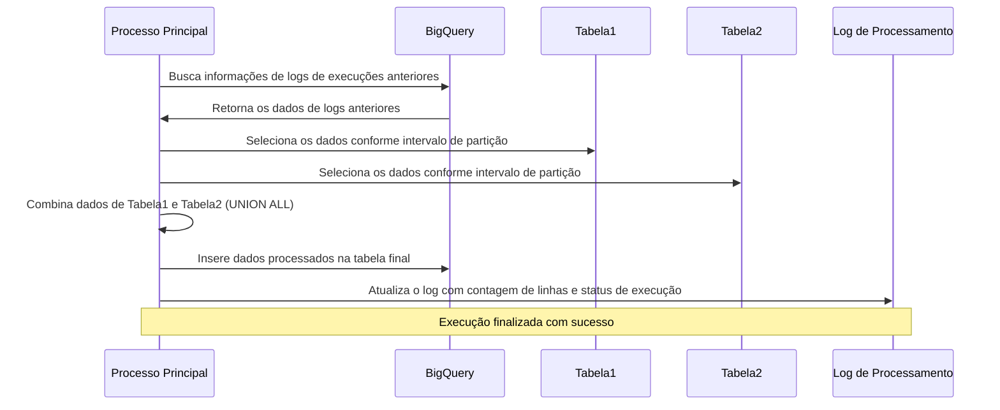

```mermaid
sequenceDiagram
    participant Processo Principal
    participant BigQuery
    participant Tabela1
    participant Tabela2
    participant Log de Processamento

    Processo Principal->>BigQuery: Busca informações de logs de execuções anteriores
    BigQuery->>Processo Principal: Retorna os dados de logs anteriores

    Processo Principal->>Tabela1: Seleciona os dados conforme intervalo de partição
    Processo Principal->>Tabela2: Seleciona os dados conforme intervalo de partição

    Processo Principal->>Processo Principal: Combina dados de Tabela1 e Tabela2 (UNION ALL)
    Processo Principal->>BigQuery: Insere dados processados na tabela final

    Processo Principal->>Log de Processamento: Atualiza o log com contagem de linhas e status de execução

    Note over Processo Principal, Log de Processamento: Execução finalizada com sucesso

```