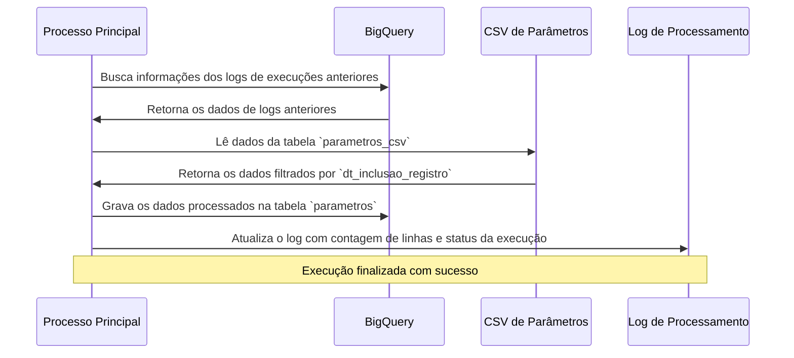

```mermaid
sequenceDiagram
    participant Processo Principal
    participant BigQuery
    participant CSV de Parâmetros
    participant Log de Processamento

    Processo Principal->>BigQuery: Busca informações dos logs de execuções anteriores
    BigQuery->>Processo Principal: Retorna os dados de logs anteriores

    Processo Principal->>CSV de Parâmetros: Lê dados da tabela `parametros_csv`
    CSV de Parâmetros->>Processo Principal: Retorna os dados filtrados por `dt_inclusao_registro`

    Processo Principal->>BigQuery: Grava os dados processados na tabela `parametros`

    Processo Principal->>Log de Processamento: Atualiza o log com contagem de linhas e status da execução

    Note over Processo Principal, Log de Processamento: Execução finalizada com sucesso

```