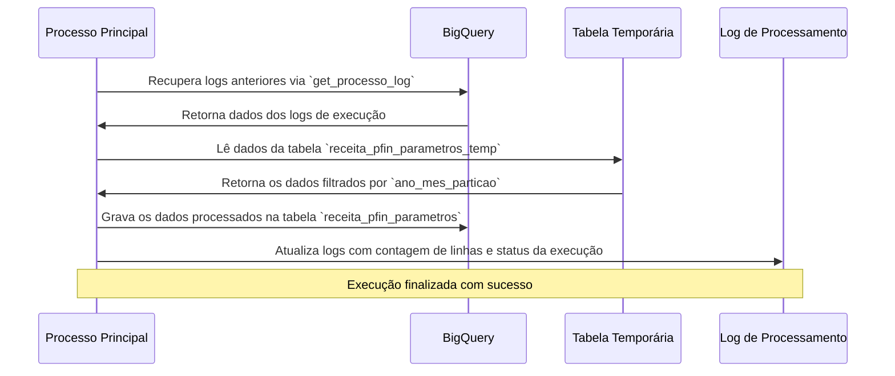

```mermaid
sequenceDiagram
    participant Processo Principal
    participant BigQuery
    participant Tabela Temporária
    participant Log de Processamento

    Processo Principal->>BigQuery: Recupera logs anteriores via `get_processo_log`
    BigQuery->>Processo Principal: Retorna dados dos logs de execução

    Processo Principal->>Tabela Temporária: Lê dados da tabela `receita_pfin_parametros_temp`
    Tabela Temporária->>Processo Principal: Retorna os dados filtrados por `ano_mes_particao`

    Processo Principal->>BigQuery: Grava os dados processados na tabela `receita_pfin_parametros`

    Processo Principal->>Log de Processamento: Atualiza logs com contagem de linhas e status da execução

    Note over Processo Principal, Log de Processamento: Execução finalizada com sucesso

```