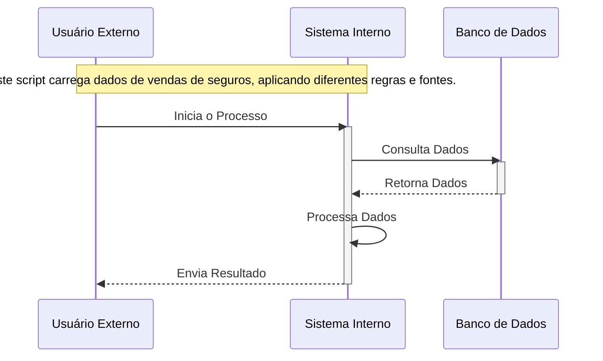

```mermaid
sequenceDiagram
    %% Este diagrama representa o processo de 'seguro_venda_credit'.
    Note over Usuário, Sistema: Este script carrega dados de vendas de seguros, aplicando diferentes regras e fontes.

    participant Usuário as Usuário Externo
    participant Sistema as Sistema Interno
    participant BancoDados as Banco de Dados

    Usuário->>Sistema: Inicia o Processo
    activate Sistema
    Sistema->>BancoDados: Consulta Dados
    activate BancoDados
    BancoDados-->>Sistema: Retorna Dados
    deactivate BancoDados
    Sistema->>Sistema: Processa Dados
    Sistema-->>Usuário: Envia Resultado
    deactivate Sistema

```