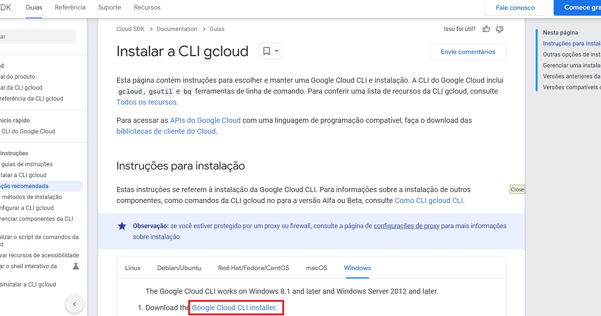
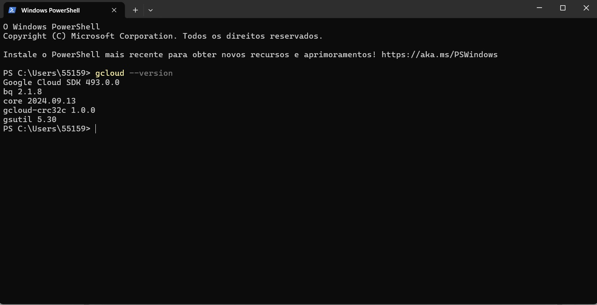

# Data Generator - Halo World

Este projeto é um gerador de dados para o Sprint 01 do projeto **FinOps**. Ele utiliza o Google Cloud BigQuery para gerar e processar dados.

## Pré-requisitos

- Python 3.10 ou superior
- Google Cloud CLI
- Conta Google com acesso ao Google Cloud BigQuery
- Acesso à internet para baixar dependências e autenticar no Google Cloud

---

## Instruções para rodar o projeto

### 1. Clonar o repositório

Clone o repositório para sua máquina local:

```bash
git clone https://github.com/2RP-Squad404/Halo-World.git
```

Entre na pasta do projeto:

```bash
cd Halo-World/Sprints/Sprint_01/data_generator
```

---

### 2. Configurar o ambiente virtual (Somente Linux)

#### No Ubuntu:

1. Criar e ativar o ambiente virtual:

```bash
python3 -m venv .venv
source .venv/bin/activate
```

Caso você não tenha o pacote `venv` instalado, faça isso com:

```bash
sudo apt update
sudo apt install -y python3-venv
```

2. Instalar dependências:

Se o projeto tiver um arquivo `requirements.txt`, instale as dependências com:

```bash
pip install -r requirements.txt
```

---

### 3. Instalar a CLI do Google Cloud

#### No Ubuntu:

Instale a CLI do Google Cloud com o comando:

```bash
sudo snap install google-cloud-cli --classic
```

#### No Windows:

Baixe e instale a Google Cloud CLI [aqui](https://cloud.google.com/sdk/docs/install?hl=pt_br&_gl=1*hqmbvj*_up*MQ..&gclid=Cj0KCQjwo8S3BhDeARIsAFRmkOOgrCgnl9O-8Xvb8r41OvcYyrZeWzpr-tLnO8mhQMm0cx8lWGYHrwkaAhmnEALw_wcB&gclsrc=aw.ds).



- Durante a instalação, clique em **Next** nas opções.

---

### 4. Autenticação

Durante a inicialização, você verá uma mensagem como esta:

```bash
You must sign in to continue. Would you like to sign in (Y/n)?
```

Responda com **Y** para abrir o navegador e realizar o login com sua conta Google.

#### 4.1 Login no Navegador

O navegador abrirá uma página para autenticação no Google e concessão de permissões para o Google Cloud CLI. Faça login com suas credenciais.

---

### 5. Escolher o Projeto

Após fazer o login, você verá opções para escolher o projeto no qual deseja trabalhar:

```bash
Pick cloud project to use:
 [1] fir-auth-1a0af
 [2] sapient-cycling-434419-u0
 [3] testing-firebase-ef18f
 [4] Enter a project ID
 [5] Create a new project
```

Você pode:

- Selecionar um projeto existente digitando o número correspondente.
- Criar um novo projeto escolhendo a opção **5**.
- Inserir o ID do projeto manualmente escolhendo **4**.

---

### 6. Configurar Região e Zona Padrão

Após escolher ou criar um projeto, você será perguntado se deseja configurar uma região e zona padrão:

```bash
Do you want to configure a default Compute Region and Zone? (Y/n)?
```

Responda **Y** se planeja utilizar serviços que dependem de regiões e zonas (ex: Compute Engine).

- **Região**: Defina a localização geográfica para os recursos (ex: `us-central1`, `europe-west1`).
- **Zona**: Escolha uma subdivisão dentro da região (ex: `us-central1-a`, `europe-west1-b`).

---

### 7. Verificar a Instalação

Para verificar se tudo foi instalado corretamente, execute:

```bash
gcloud info
```

Esse comando exibirá informações sobre a instalação e as configurações do projeto.

---

## Executando o Projeto no Windows

1. Abra o PowerShell e verifique a instalação com:

```bash
gcloud --version
```



2. Navegue até a pasta onde o projeto foi clonado, exemplo:

```bash
cd C:\Users\seu-usuário\Halo-World\Sprints\Sprint_01\data_generator
```

3. Abra o projeto em um editor de código.

4. Crie o ambiente virtual:

```bash
python -m venv .venv
```

5. Ative o ambiente virtual:

```bash
.venv\Scripts\activate
```

6. Instale as dependências:

```bash
pip install -r requirements.txt
```

---

## 8. Autenticar as Credenciais da Aplicação

Se necessário, autentique as credenciais do Google Cloud:

```bash
gcloud auth application-default login
```

Siga as instruções para completar o login.

---

## 9. Executar o Script

Finalmente, execute o script `data_generator.py`:

No Linux:

```bash
python3 data_generator.py
```

No Windows:

```bash
python data_generator.py
```

---

## Contribuição

Contribuições são bem-vindas! Sinta-se à vontade para abrir *issues* ou enviar *pull requests* para melhorias e correções.

---

Com esse guia, você tem as instruções necessárias para rodar o projeto tanto no Ubuntu quanto no Windows.
Certifique-se de ajustar as dependências no arquivo `requirements.txt`, se necessário.
